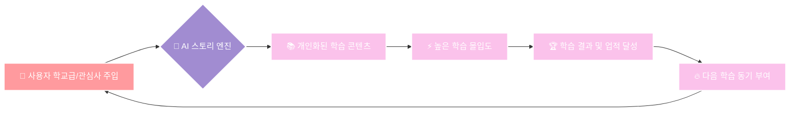

<div align="center">
  <h1>🌟 PRISM</h1>
  <p><b>AI 기반 넥스트 제너레이션 인터랙티브 교과서</b></p>
  <p><i>"지식을 읽는 것이 아니라, 경험하는 미래형 학습 플랫폼"</i></p>

  [](https://reactjs.org/)
  [](https://www.typescriptlang.org/)
  [](https://firebase.google.com/)
  [](https://deepmind.google/technologies/gemini/)
  [](https://tailwindcss.com/)
</div>

<br />

> [!NOTE]
> **PRISM (Personalized Reactive Interactive Story Module)** 은 국가 교육과정에 인공지능(GenAI) 기술을 결합하여 학생들에게 몰입형 스토리텔링과 상호작용적 학습 경험을 제공하는 혁신적인 맞춤형 교육 플랫폼입니다.

---

## 🎯 1. 서비스 선순환 구조 (Value Flow)

학습자의 정보가 콘텐츠에 즉각적으로 반영되어, 선순환적인 학습 동기를 부여합니다.



---

## 📖 2. 핵심 가치 (Core Values)

| 🎯 Core Value | 💡 Description | 🛠 Technology / Feature |
| :--- | :--- | :--- |
| **몰입형 경험** | 비주얼 노벨 스타일의 인터페이스 및 Particles 인공지능 효과 | `React`, `Framer Motion`, `Magic UI` |
| **초개인화 학습** | 관심사와 학교급(초/중/고)을 AI가 인지하여 맞춤형 시나리오 & 어조 생성 | `Gemini 3.1 Flash Prompting` |
| **글로벌 스케일** | 8개국 × 3개 학교급 × 3개 과목 × 4개 단원 = 총 288개 표준형 모듈 탑재 | `i18n`, `Global Curriculum Schema` |
| **데이터 영속성** | Firebase 기반 학습 이력 보존 및 기존 프로필/성취도 자동 연동 | `Firebase Firestore / Auth` |

---

## 🚀 3. 주요 기능 (Key Features)

- 🧠 **에이전틱 스토리 엔진**: **Gemini 3.1 Flash** 모델을 활용, 학습자의 **학교급(초등/중등/고등)** 에 최적화된 문장 길이 및 어휘 수준으로 시나리오를 동적 생성합니다.
- 🎨 **멀티모달 시각화**: **Gemini 2.5 Flash Image** 를 이용하여 장면별 맞춤형 테마 및 배경 이미지를 실시간 렌더링합니다.
- 🌍 **글로벌 교육과정**: 한국, 미국, 일본, 영국 등 8개국 표준 교육과정 기반 **288개 모듈** 이 내장되어 있습니다.
- 🎮 **인터랙티브 활동**: 학년별 수준에 맞춘 용어 매칭 게임, 가치 판단 투표, 사례 연구 퀴즈를 제공합니다.
- ✨ **프리미엄 UI/UX**: 2단 뷰와 피처 하이라이트를 결합한 **몰입형 랜딩 / 로그인 인터페이스** 가 적용되어 있습니다.

---

## 🛠 4. 기술 스택 (Tech Stack)

### 💻 Frontend
> 사용자 경험 중심의 반응형/애니메이션 웹 아키텍처
* **Core**: `React 18` (Vite), `TypeScript (Strict)`
* **Styling**: `Tailwind CSS`, `Magic UI`, `Lucide React`

### ⚙️ Backend & AI
> 서버리스 인증 및 멀티모달 대형 언어 모델 통신
* **Database & Auth**: `Firebase` (Firestore, Authentication)
* **Intelligence**: `Google Gemini API` (3.1 Flash, 2.5 Flash Image)

---

## 📂 5. 프로젝트 문서 (Documentation)

PRISM의 전체 시스템 및 비즈니스 로직을 체계적으로 파악하기 위한 문서들입니다.

| Category | Document Link | Description |
| :--- | :--- | :--- |
| **Planning** | [01. 프로젝트 기획서](./docs/01_PROJECT_PROPOSAL.md) | 최초 기획 의도, 핵심 컨셉, 마일스톤 및 로드맵 |
| **Analysis** | [02. 요구사항 분석서](./docs/02_REQUIREMENT_ANALYSIS.md) | 기능적/비기능적 요구사항 및 제약사항 정의 |
| **Design** | [03. 시스템 아키텍처](./docs/03_SYSTEM_ARCHITECTURE.md) | 시스템 구성도, 데이터 흐름도, ADR(의사결정) 기록 |
| **UI/UX** | [04. 디자인 규격](./docs/04_DESIGN_SYSTEM_SPEC.md) | 타이포그래피, 컴포넌트, 테마 엔진 시각 규격 |
| **Data** | [05. 데이터베이스 설계](./docs/05_DATABASE_SCHEMA_ERD.md) | NoSQL 스키마, 컬렉션 구조 및 ERD |
| **Dev** | [06. 구현 상세](./docs/06_IMPLEMENTATION_DETAIL.md) | 핵심 실무 로직 스니펫, 에이전트 연동 일지 |
| **Test** | [07. 검증 및 품질](./docs/07_TEST_VERIFICATION.md) | 테스트 케이스, 통합 테스트 전략 및 트러블슈팅 |
| **Summary** | [08. 성과 보고서](./docs/08_FINAL_PROJECT_REPORT.md) | 프로젝트 총평, 달성 목표 추적 및 향후 계획 |
| **Guide** | [API 레퍼런스](./docs/API_REFERENCE.md) <br/> [사용자 매뉴얼](./docs/USER_MANUAL.md) | 코드 레벨 분석 및 실사용자 관점의 가이드 문서 |

---

## 💻 6. 설치 및 환경 세팅 (Quick Start)

### 🔑 6.1 환경 변수 설정
`.env` (또는 `.env.local`) 파일을 루트에 생성하고 본인의 API Key를 입력합니다:
```env
VITE_FIREBASE_API_KEY=your_firebase_api_key
VITE_GEMINI_API_KEY=your_gemini_api_key
```

### 🏃‍♂️ 6.2 패키지 설치 및 실행
```bash
# 종속성 설치
npm install

# 개발 서버 실행 (기본 3000포트)
npm run dev
```

---

<div align="center">
  <p>© 2026 PRISM — Personalized Reactive Interactive Story Module. All Rights Reserved.</p>
</div>
