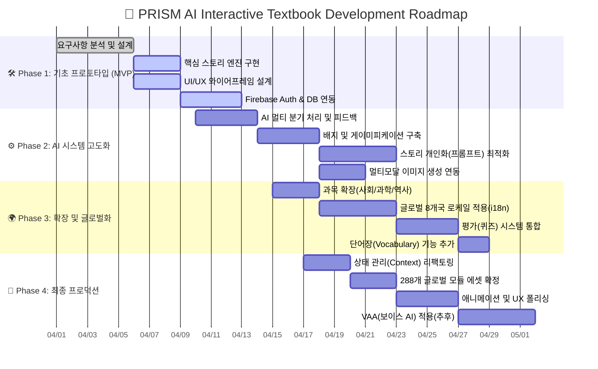

  
  <h1>📄 01. 프로젝트 기획서 (Project Proposal)</h1>
  
<b>PRISM (Personalized Reactive Interactive Story Module)</b>

  
AI 기반 넥스트 제너레이션 인터랙티브 교과서 플랫폼

 

> [!IMPORTANT]
> **🚀 기획 목적 (Core Objectives)** 
> 기존의 딱딱한 주입식 교육에서 완전히 탈피하여 학습자가 **스토리의 주인공**이 됩니다. 지속적인 의사결정 과정을 통해 민주주의, 법, 과학 등의 추상적 개념을 능동적으로 체험하고 체득하게 만드는 것이 최종 목표입니다. 학습은 시험을 위한 것이 아니라, 경험을 위한 것임을 증명합니다.

---

## 🎯 1. 프로젝트 개요 (Overview)

| 🏷 항목 | 📝 상세 내용 |
| :--- | :--- |
| **✨ 프로젝트 명** | `PRISM` — AI 기반 넥스트 제너레이션 인터랙티브 교과서 |
| **💡 핵심 컨셉** | 🎮 비주얼 노벨 스타일의 **선택형 스토리텔링** + 🤖 **초개인화 AI 콘텐츠 생성** |
| **🎯 타겟 유저** | 👧 초등학생, 👦 중학생, 🧑 고등학생 및 상호작용형 자율학습을 원하는 모든 사용자 |
| **👥 페르소나 1** | "글로만 읽는 교과서는 지루해. 내가 시장이나 법관이 되어 상황을 해결해보고 싶어!" (중학생 리더십 성향) |
| **👥 페르소나 2** | "어려운 과학 현상을 마법 세계 이야기로 바꾸어 읽어보고 싶어." (초등학생 판타지 성향) |
| **👥 페르소나 3** | "배운 내용을 외국어로 실전처럼 연습해 보고, 퀴즈로 바로바로 점검할래." (고등학생 융합 학습 성향) |

---

## 🗺 2. 로드맵 & 마일스톤 (Roadmap)

전체적인 프로젝트 마일스톤은 단계적으로 개념 검증, 고도화, 그리고 글로벌 확장까지 이뤄집니다. 각 단계는 짧은 사이클의 애자일(Agile) 방식으로 진행됩니다.

---

## 🔍 3. 기획 배경 (Pain Points & Opportunity)

### 🔴 문제점 (Pain Points)
1. **📉 낮은 몰입도**: 사회, 법, 정치, 과학 법칙 등 추상적인 개념은 텍스트 중심으로 구성되어 있어 학생들의 흥미와 집중도가 급격히 저하됨.
2. **🧩 초개인화의 부재**: 학생 개개인의 이해도, 관심사, 독해 속도에 맞춘 '맞춤형' 교육 제공의 한계. 진도가 느리거나 빠른 학생 모두 불만족.
3. **💤 일방향적 정보 전달**: 정해진 결말을 수용하기만 하므로, 비판적 사고력과 문제 해결 능력 배양에 취약함.

### 🟢 기회 요소 (Opportunities - Solution)
1. **✨ 초개인화 서사 매핑(Dynamic Narrative Mapping)**: 학습자의 접속 국가, 학교급(Elementary/Middle/High), 관심사, 어학 수준을 프롬프트에 동기화하여 나만의 교과서를 실시간으로 렌더링.
2. **🎮 에듀테크 + 게임(Edutainment)**: 지루한 교과 과정을 선택형 게임처럼 풀어, 능동적 인지 과정 유도.
3. **🌎 디지털 트랜스포메이션 (DT)**: 다국어(8개국), 3과목, 학교급별 등 수백 개의 모듈을 하나의 통합 플랫폼에 담아내어 확장성 극대화.

---

## 🛠 4. 주요 기능 정의 (Initial Scope)

1. 🤖 **동적 스토리 미디어 엔진**: `Gemini 3.1 Pro/Flash` 모델을 활용. 학습자 수준을 파악하여 적절한 난이도/길이/어투의 시나리오, 선택지, 그리고 학습 결과를 반환.
2. 🎨 **멀티모달 배경(Vision) 생성**: `Gemini 2.5 Flash Image` (또는 DALL-E)를 이용. 스토리의 감정/테마에 맞는 배경 에셋을 16:9 뷰포트 비율로 자동 생성 후 렌더링(프롬프트 조합 자동화).
3. 👤 **지능형 프로파일링 & 온보딩**: 닉네임, 학습레벨, 선호 키워드, 국가 등의 지표를 Cloud Firestore에 실시간 적재하고 AI 프롬프트 생성 시 컨텍스트로 융합.
4. 🧠 **맞춤형 평가(Assessment) 시스템**: 교과 맥락과 학습자가 방금 체험한 스토리 라인을 기반으로 한 '지능형 심화 퀴즈(객관식/O,X 등)' 출제.
5. 🏆 **성취와 보상(Gamification)**: 단원 컴플리트 배지(Badges), 레벨업 시스템, 진도율 프로그레스 바 제공.

---

## 🌟 5. 기대 효과 (Expected Impact)

> [!TIP]
> **성적 향상, 그 이상의 경험!**  
> 1️⃣ **🧠 학습 효율성 체감**: 자기주도적 시뮬레이션을 통해 단순 암기가 아닌 원리 파악을 도와, 장기 기억 유지력(Retention)과 개념 응용력을 극대화합니다.  
> 2️⃣ **📈 글로벌 에듀테크 확장성**: 언어권 변경(`i18n`)과 로컬 커리큘럼 전환 코드만으로 별도 앱 개발 없이 세계 각국의 에듀테크 시장에 즉각 진출이 가능합니다.  
> 3️⃣ **🗣 논리적 사고 강화**: "만약 내가 이러했다면?"이라는 'If' 시나리오에 대처하며 판단력 함양.

---

  <b><a href="./02_REQUIREMENT_ANALYSIS.md">👉 다음 단계: 02. 요구사항 분석 및 정의 (Next)</a></b>

