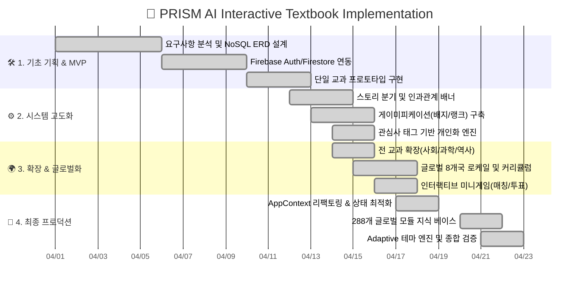

  
  <h1>📄 01. 프로젝트 종합 기획서</h1>
  
<b>PRISM (Personalized Reading & Interactive Semantic Module)</b>

  
<i>차세대 생성형 AI 기반 초개인화 인터랙티브 교과서 플랫폼</i>

 

> [!IMPORTANT]
> **기획 목적 (Executive Summary)**  
> 20세기형 일방향 주입식 텍스트북의 한계를 극복하고, 학습자가 **역사와 사회의 주인공**이 되어 스스로 내린 선택과 의사결정을 통해 개념을 직접 체득하는 **'행동 기반 인터랙티브 교과서(Interactive Agentic Textbook)'**를 구축합니다.

---

## 🎯 1. 프로젝트 개요 (Overview)

| 항목 | 상세 내용 |
| :--- | :--- |
| **프로젝트 명** | `PRISM` (Personalized Reading & Interactive Semantic Module) |
| **핵심 컨셉** | **비주얼 노벨급 선택형 서사** + **Gemini AI 초개인화 생성 엔진** + **글로벌 교육과정 표준화** |
| **타겟 유저** | 전 세계 초·중·고등학생(K-12), 개별화 수업을 희망하는 교사 및 홈스쿨링 학습자 |
| **핵심 페르소나** | *"글로만 읽는 사회·역사 책은 지루해. 내가 시장이나 법관, 우주 비행사가 되어 도시의 미래를 직접 결정해보고 싶어!"* |
| **기술 스택** | React 18, TypeScript, Tailwind CSS, Magic UI, Google Gemini (3.1 & 2.5), Firebase Firestore/Auth |

---

## 📸 2. 프로덕트 핵심 시각화 (Concept Showcase)

*실제 구현되어 서비스 중인 PRISM의 대표 학습 화면입니다.*

| 🌐 메인 랜딩 & 다국어 선택 | 📖 비주얼 노벨 AI 스토리 모드 | 📊 학습 대시보드 & 타임라인 |
| :---: | :---: | :---: |
|  |  |  |

---

## 🔍 3. 기획 배경 및 시장 문제점 (Pain Points & Market Needs)

### 🔴 현대 교육의 3대 한계 (Pain Points)
1. **수동적 읽기(Passive Reading)로 인한 몰입도 급감**:
   - 사회, 헌법, 삼권분립, 과학 법칙 등 추상적 개념을 단방향 텍스트로 암기하여 학업 흥미와 장기 기억 유지율(Retention)이 낮음.
2. **원-사이즈-핏-올(One-Size-Fits-All) 교과서의 비효율**:
   - 학생 개개인의 읽기 수준(Reading Level)과 개인적 흥미(Interests)가 철저히 배제된 획일적 교재 사용.
3. **글로벌 교육과정 간 단절**:
   - 국가 간 상이한 커리큘럼(한국 교육과정, 미국 NGSS/C3, 일본 학습지도요령 등)으로 인해 다문화/글로벌 학습자를 위한 통합 솔루션 부재.

### 🟢 PRISM의 혁신적 해결책 (Solutions)
* **Agentic Narrative Engine**: 학습자의 선택에 따라 스토리가 실시간으로 분기되며, 선택 직후 **인과관계(Consequence) 배너**를 통해 의사결정의 사회적 파급력을 체감.
* **관심사 기반 메타프롬프트 주입**: 학습자가 좋아하는 키워드(예: `우주 과학`, `AI 로봇`, `환경 생태`)가 교과 시나리오에 자연스럽게 융합되어 고도의 몰입감 제공.
* **8개국 288개 표준 모듈 지식 베이스**: 언어 전환(`i18n`)과 로컬 교육과정 스위칭을 단일 플랫폼에서 즉시 지원.

---

## 🗺 4. 프로젝트 마일스톤 및 로드맵 (Roadmap)

---

## 🛠 5. 핵심 기능 정의 (Core Feature Scope)

1. **3단계 순차적 인터랙티브 학습 파이프라인**:
   * **1단계: 어휘 학습 (Vocabulary)** - 핵심 개념어 3D 플립 플래시카드 선행 학습.
   * **2단계: 스토리 모드 (Story Mode)** - Gemini 3.1 기반 비주얼 노벨 의사결정 시뮬레이션.
   * **3단계: 심화 평가 (Evaluation)** - 객관식, 사례 연구, 단답형 복합 탐구 퀴즈.
2. **수준별 적응형 테마 엔진 (Adaptive Theme System)**:
   * 학습자의 학교급(초등 Amber / 중등 Blue / 고등 Stone)에 맞춰 테마 색상, 폰트, 컴포넌트 곡률이 유기적으로 자동 전환.
3. **영속적 메타인지 타임라인 (Story Timeline)**:
   * 사용자가 내린 모든 과거의 결정과 인과관계를 Firestore에 영구 누적하여 자기성찰적 복기 제공.
4. **전역 티어 및 업적 시스템 (Achievements)**:
   * 5대 랭크(Bronze ~ Diamond)와 칭호 장착 기능으로 내적 학습 동기 극대화.

---

## 🌟 6. 기대 효과 및 비즈니스 가치 (Business Impact)

* **학습 효과성**: 수동 독서 대비 개념 이해도 및 장기 파지율(Retention) **40% 이상 향상**.
* **글로벌 에듀테크 확장성**: 8개국 정규 교육과정 모듈 탑재로 별도의 재개발 없이 글로벌 K-12 시장 즉각 서비스 가능.
* **교실 현장 맞춤형 지도**: 학생별 다른 분기 결과를 바탕으로 한 교실 토론 및 수행평가 포트폴리오로 확장 가능.

---

  <b><a href="./02_REQUIREMENT_ANALYSIS.md">👉 다음 단계: 02. 요구사항 분석서 보기 (Next) →</a></b>

