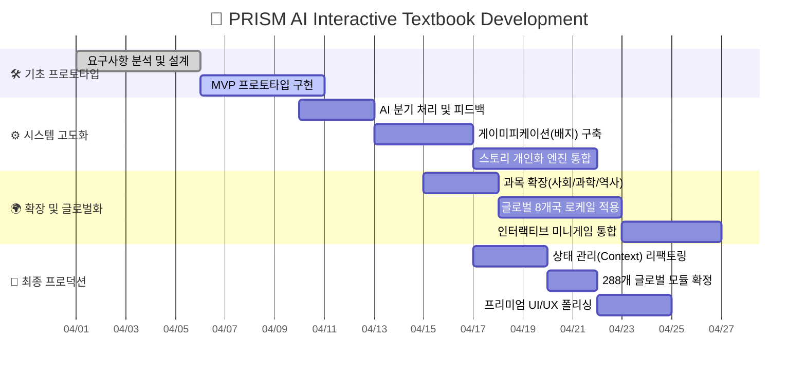

  
  <h1>📄 01. 프로젝트 기획서</h1>
  
<b>PRISM (Personalized Reactive Interactive Story Module)</b>

 

> [!IMPORTANT]
> **기획 목적** 
> 주입식 교육에서 탈피하여 학습자가 **스토리의 주인공**이 됩니다. 지속적인 의사결정 과정을 통해 민주주의, 법, 과학 등의 추상적 개념을 능동적으로 체험하고 체득하게 만드는 것이 최종 목표입니다.

---

## 🎯 1. 프로젝트 개요 (Overview)

| 항목 | 상세 내용 |
| :--- | :--- |
| **프로젝트 명** | `PRISM` — AI 기반 넥스트 제너레이션 인터랙티브 교과서 |
| **핵심 컨셉** | 비주얼 노벨 스타일의 **선택형 스토리텔링** + **초개인화 AI 콘텐츠 생성** |
| **타겟 유저** | 초·중·고등학생 및 자율학습을 원하는 사용자 |
| **페르소나** | "글로만 읽는 교과서는 지루해. 내가 시장이나 법관이 되어 상황을 해결해보고 싶어!" |

---

## 🗺 2. 로드맵 & 마일스톤 (Roadmap)

전체적인 프로젝트 마일스톤은 단계적으로 개념 검증, 고도화, 그리고 글로벌 확장까지 이뤄집니다.

---

## 🔍 3. 기획 배경 (Pain Points & Opportunity)

### 🔴 문제점 (Pain Points)
- **낮은 몰입도**: 사회, 법, 정치 등 추상적인 개념은 텍스트(교과서) 기반 학습 시 학생들의 흥미가 급격히 저하됨.
- **초개인화의 부재**: 학생 개개인의 이해도, 관심사, 속도에 맞춘 '맞춤형' 교육 제공의 한계.

### 🟢 기회 요소 (Opportunities - Solution)
- **초개인화 서사 매핑**: 학습자의 접속 국가, 선택 학교급(Elementary/Middle/High), 그리고 주관심사를 프롬프트에 주입하여 나만의 교과서를 동적으로 렌더링.
- **디지털 트랜스포메이션 (DT)**: 288개의 정규 교육과정 모듈을 탑재하여 글로벌 에듀테크 전환 가속화.

---

## 🛠 4. 주요 기능 정의 (Initial Scope)

1. 🤖 **동적 스토리 엔진**: `Gemini 3.1 Flash` 모델을 이용. 학습자 수준을 파악하여 적절한 난이도/길이/어투의 시나리오 및 선택지를 반환.
2. 🎨 **멀티모달 배경 생성**: `Gemini 2.5 Flash Image` 를 이용, 스토리의 감정/테마에 맞는 배경 에셋을 16:9 비율로 자동 생성 후 삽입.
3. 👤 **지능형 프로파일링**: 닉네임, 학습레벨, 선호 키워드 등의 지표를 Firestore에 적재하고 세션 내내 활용.
4. 🧠 **맞춤형 평가 시스템**: 교과 맥락과 학습자가 선택한 스토리에 기반한 '지능형 심화 퀴즈'.

---

## 🌟 5. 기대 효과 (Expected Impact)

> [!TIP]
> **성적 향상 그 이상**  
> 1️⃣ **학습 효율성**: 자기주도적 시뮬레이션을 통해 장기 기억 유지력(Retention)과 개념 응용력 극대화.  
> 2️⃣ **글로벌 확장성**: 언어권 변경(`i18n`)과 로컬 커리큘럼 전환만으로 다국적 글로벌 에듀테크 시장에 즉각 진출 가능.

---

  <b><a href="./02_REQUIREMENT_ANALYSIS.md">👉 다음 단계: 02. 요구사항 분석 및 정의 (Next)</a></b>

