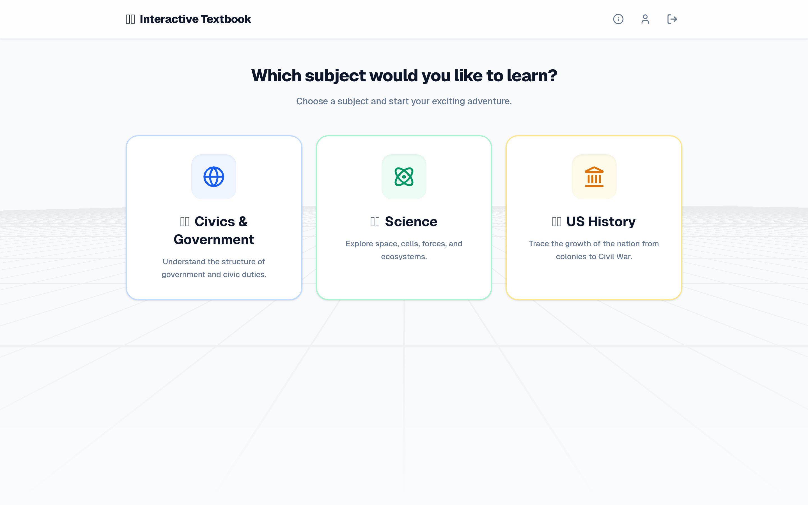
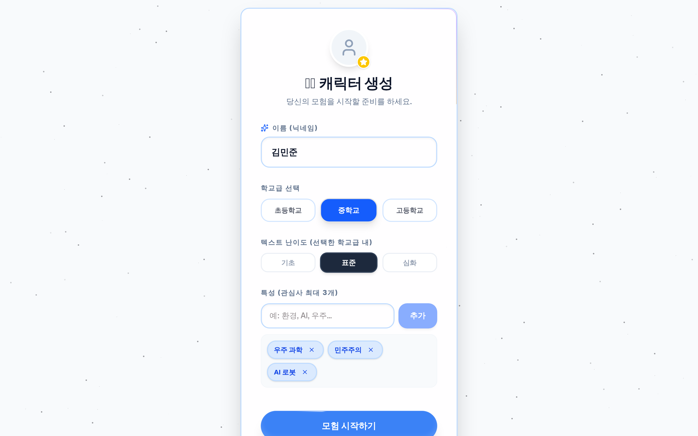
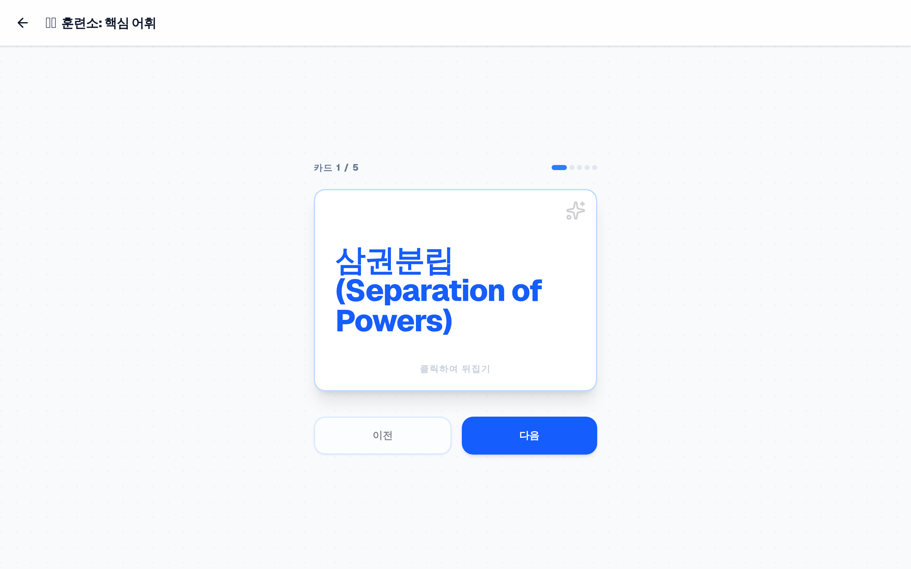
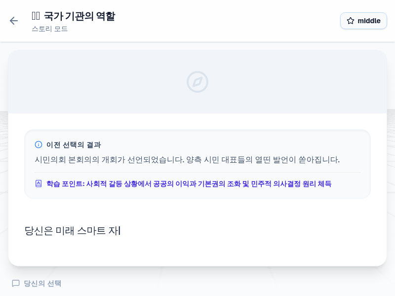
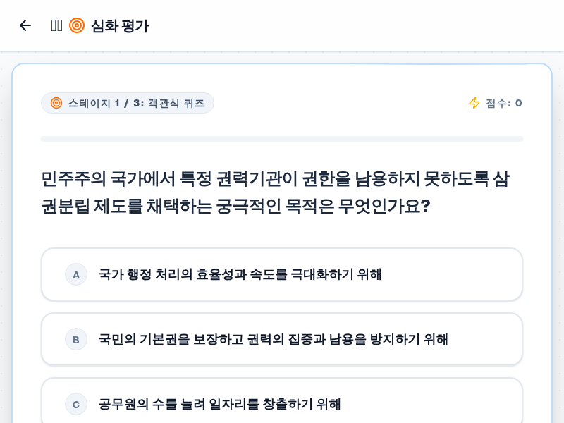
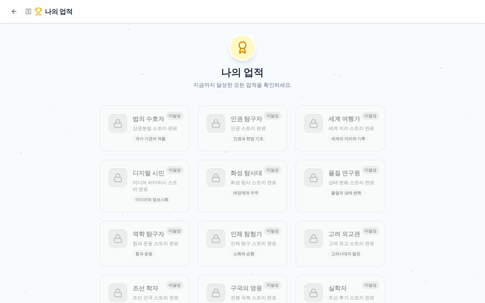

  
  <h1>📋 02. 요구사항 분석서 (SRS)</h1>
  
<b>PRISM 시스템 기능적 / 비기능적 요구사항 및 제약사항 상세 명세</b>

 

> [!IMPORTANT]  
> 본 문서는 **PRISM — AI 기반 인터랙티브 교과서**의 설계, 구현 및 품질 검증의 기준이 되는 소프트웨어 요구사항 명세서(Software Requirements Specification)입니다.

---

## ⚙️ 1. 기능 요구사항 (Functional Requirements)

### 🌍 F1. 글로벌 표준 교육과정 및 모듈 지원
* **F1.1 (8개국 로컬라이제이션)**: 대한민국(KR), 미국(US), 일본(JP), 중국(CN), 영국(GB), 프랑스(FR), 이탈리아(IT), 독일(DE)의 8대 국가 교육과정을 지원해야 한다.
* **F1.2 (288개 표준 모듈 지식 베이스)**: 각 국가별 3개 학교급(초등/중등/고등) × 3개 교과(사회/과학/역사) × 4개 핵심 단원 = 총 288개 독립 학습 모듈을 제공해야 한다.
* **F1.3 (동적 언어 전환)**: 언어 변경 시 UI 텍스트뿐만 아니라 단원명, 시나리오 생성 프롬프트, 퀴즈 및 피드백이 해당 국가 언어/문화권으로 즉시 동기화되어야 한다.

---

### 👤 F2. 학습자 프로필 및 인지 수준 온보딩
* **F2.1 (Google 소셜 인증)**: Firebase Authentication 기반 Google 원클릭 로그인을 지원하며 세션 상태를 영속 관리해야 한다.
* **F2.2 (3단계 학교급 선택)**: 학습자는 초등학교(`elementary`), 중학교(`middle`), 고등학교(`high`)를 선택할 수 있어야 하며, 학교급에 따라 시스템 테마와 AI 생성 난이도가 즉시 재구성되어야 한다.
* **F2.3 (관심사 메타데이터 태깅)**: 최대 3개의 자유 관심사(예: `우주 과학`, `민주주의`, `AI 로봇`)를 입력받아 AI 시나리오의 주인공 설정 및 분기 선택지의 소재로 주입해야 한다.
* **F2.4 (프로필 지속성 & 상시 수정)**: 메인 화면 헤더의 프로필 버튼을 통해 언제든 정보를 변경할 수 있어야 하며, 기존 퀴즈 기록이나 업적은 유실 없이 보존되어야 한다.

---

### 🧠 F3. 3단계 인터랙티브 학습 파이프라인
* **F3.1 (어휘 학습 - Vocabulary)**: 단원의 핵심 개념어 5개를 추출하여 앞면(용어)과 뒷면(정의 및 교과 예문)을 제공하는 3D 플립 플래시카드 인터랙션을 제공해야 한다.
* **F3.2 (비주얼 노벨 스토리 모드 - Story Mode)**:
  * Gemini 3.1 Flash 모델을 통해 학습자 수준에 부합하는 서사를 실시간 생성해야 한다.
  * 장면마다 16:9 비율의 맥락 맞춤형 배경 이미지를 렌더링해야 한다.
  * 학습자의 관심사 키워드가 태그로 반영된 최소 3개의 분기 선택지를 제공해야 한다.
  * 선택 즉시 상단에 **인과관계 피드백 배너(Consequence Banner)**를 띄워 사회적 결과와 교과 개념(`Learning Point`)을 안내해야 한다.
* **F3.3 (심화 평가 - Evaluation)**: 객관식, 상황 기반 사례 연구(Case Study), 주관식 단답형 문항을 복합 제공하고, 채점 결과와 상세 해설을 즉시 피드백해야 한다.

| 어휘 플래시카드 (F3.1) | 비주얼 노벨 스토리 (F3.2) | 심화 평가 퀴즈 (F3.3) |
| :---: | :---: | :---: |
|  |  |  |

---

### 🏆 F4. 게이미피케이션 및 학습 이력 관리
* **F4.1 (실시간 등급 티어)**: 어휘 완료(20점), 스토리 분기 진행(최대 40점), 퀴즈 최고 점수(최대 40점)를 합산(100점 만점)하여 `Bronze` ~ `Diamond` 등급을 부여해야 한다.
* **F4.2 (업적 갤러리 및 칭호)**: 교과별·행동별 특수 업적 배지를 획득할 수 있으며, 획득한 대표 칭호를 사용자 이름 옆에 장착해야 한다.
* **F4.3 (나의 스토리 발자취)**: 대시보드 하단에 사용자가 과거에 내린 모든 선택과 결과(Consequence)를 시간 순으로 복기할 수 있는 타임라인 카드를 렌더링해야 한다.

---

## 🛡 2. 비기능 요구사항 (Non-functional Requirements)

### 🎨 N1. 사용자 경험 및 시각 인터페이스 (UX/UI)
* **N1.1 (Magic UI 및 마이크로 인터랙션)**: `RetroGrid`, `Particles`, `BorderBeam`, `ShimmerButton`, `TypingAnimation`을 유기적으로 결합하여 상호작용의 몰입감을 극대화한다.
* **N1.2 (수준별 가변 테마 엔진)**:
  * 초등: Amber 계열 파스텔톤, `rounded-3xl`의 둥근 곡률, 친근한 고딕.
  * 중등: Blue 계열 청량한 모던톤, `rounded-2xl`, 정갈한 산세리프.
  * 고등: Stone/Slate 계열 클래식 모노크롬, `rounded-lg`, 학술적 타이포그래피.

### 🚀 N2. 성능 및 반응 속도 (Performance & Scalability)
* **N2.1 (비동기 체감 지연 최소화)**: AI 시나리오 및 이미지 생성 대기 시간 동안 Skeleton UI 및 애니메이션 로더를 노출하여 사용자의 이탈을 방지한다.
* **N2.2 (모듈 아키텍처 확장성)**: 신규 교과목이나 국가 교육과정 추가 시 기존 비즈니스 로직 수정 없이 데이터 JSON 주입만으로 확장이 가능한 순수 데이터 주도형 설계를 유지한다.

### 🔐 N3. 데이터 무결성 및 보안 (Security & Integrity)
* **N3.1 (Firestore Security Rules)**: 인증된 본인의 고유 UID에만 읽기/쓰기 권한을 부여하여 타인의 학습 데이터 침해를 원천 차단한다.
* **N3.2 (엄격한 JSON Schema 파싱)**: Gemini API 통신 시 사전에 정의된 JSON 포맷을 강제하며, 파싱 에러 발생 시 자동 복구 및 폴백 메커니즘을 가동한다.

---

## 📊 3. 요구사항 추적 매트릭스 (Requirements Traceability Matrix)

| 요구사항 ID | 기능 명칭 | 구현 컴포넌트 / 훅 | 검증 방식 | 상태 |
| :---: | :--- | :--- | :--- | :---: |
| **F1.1 ~ F1.3** | 글로벌 8개국 다국어 커리큘럼 | `AppContext`, `i18n.ts`, `mockData.ts` | 8개 언어 스위칭 무결성 테스트 | ✅ 완료 |
| **F2.1 ~ F2.4** | 프로필 온보딩 & 학교급 동기화 | `ProfileSetup.tsx`, `useProfile.ts` | 학교급 변경 시 테마 및 DB 동기화 검증 | ✅ 완료 |
| **F3.1** | 어휘 플래시카드 | `Vocabulary.tsx`, `PromptFactory.ts` | 카드 플립 3D 인터랙션 및 점수 누적 | ✅ 완료 |
| **F3.2** | 비주얼 노벨 스토리 모드 | `StoryModeView.tsx`, `useStoryMode.ts` | 관심사 태그 분기 및 Consequence 배너 | ✅ 완료 |
| **F3.3** | 심화 평가 퀴즈 | `EvaluationView.tsx`, `EvaluationContainer.tsx` | 다유형 문항 채점 및 해설 피드백 | ✅ 완료 |
| **F4.1 ~ F4.3** | 랭크 티어, 업적, 발자취 | `DashboardView.tsx`, `Achievements.tsx` | 점수 합산 랭크 변동 및 타임라인 복기 | ✅ 완료 |
| **N1.1 ~ N1.2** | 수준별 가변 테마 & Magic UI | `theme.ts`, `RetroGrid`, `ShimmerButton` | 초/중/고 테마 렌더링 캡처 검증 | ✅ 완료 |

---

  <b><a href="./01_PROJECT_PROPOSAL.md">← 이전: 01. 프로젝트 기획서</a> &nbsp;|&nbsp; <a href="./03_SYSTEM_ARCHITECTURE.md">다음: 03. 아키텍처 설계 (Next) →</a></b>

