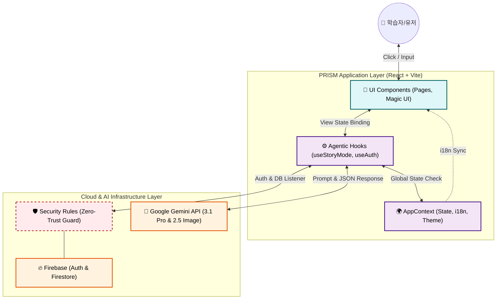
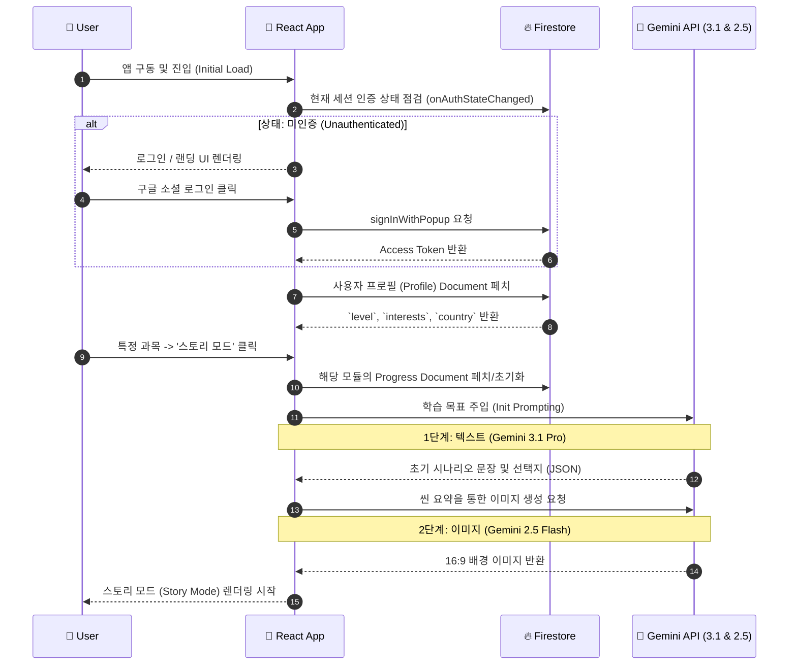

  
  <h1>🏗 03. 시스템 아키텍처 설계 (System Architecture)</h1>
  
<b>프론트엔드, AI 인텔리전스 레이어, 클라우드 인프라 간의 상호작용 및 데이터 흐름</b>

 

> [!NOTE]
> 'PRISM'은 현대적인 **Serverless Architecture** 패러다임을 차용하여, 프론트엔드(React) + BaaS(Firebase) + AI(Gemini API)의 순수 클라이언트 기반 인텔리전스 통신망을 구축합니다. 무거운 물리 서버 없이 글로벌 트래픽을 처리하는 것이 특징입니다.

---

## 🏢 1. 하이레벨 아키텍처 (Layered Architecture)

전통적인 클라이언트-서버 패턴에서 벗어나, 서비리스(Serverless) 및 에이전틱 훅(Agentic Hooks) 패턴을 활용합니다.

---

## 🔄 2. 데이터 흐름 및 상태 관리 (Data & State Flow)

### 📦 2.1 전역 컨텍스트 (`AppContext` & `AuthContext`)
- **🔑 `user` & `hasProfile`**: 유저의 로그인 여부 및 온보딩(프로필 설정) 완료 상태를 전역 구독.
- **🌍 `selectedCountry`**: 국가 분기 코드 (ex. `kr`, `us`, `jp`, `fr` 등 8개국)
- **🏫 `selectedSchoolLevel`**: 학교급 분기 (`elementary` / `middle` / `high`) — 프롬프트 길이나 UI 난이도 튜닝에 결합.
- **🗣 `t(key)`**: 실시간 다국어 번역 Proxy Function (JSON Dictionary).

### ⏳ 2.2 메인 라이프사이클 (Core Sequence)
인증에서부터 스토리 모드 및 배지 획득까지 이어지는 메인 시퀀스 다이어그램입니다.

---

## 🤖 3. 에이전틱 듀얼 스토리 엔진 (Agentic Dual-Engine)

> [!NOTE]  
> 단일 모델 풀링의 한계(속도 vs 정교함)를 극복하기 위해 역할을 완벽히 분리한 **Multi-Model Strategy** 방식을 채택했습니다.

| 🧠 두뇌 (Brain) | 🎛 모델 (LLM) | 🎯 주요 역할 (Roles) | 📤 응답 형태 | ⚡ 속도/비용 |
| :--- | :--- | :--- | :--- | :--- |
| **Logic Brain** | `Gemini 3.1 Pro` | 서사 진행, 분기별 인과관계 계산, 퀴즈 출제, 다음 이미지 생성용 메타 프롬프트 추출 | JSON (Schema 강제) | 고속 / 보통 |
| **Visual Brain** | `Gemini 2.5 Flash` | Logic Brain이 구상한 장면/맥락을 받아서 실시간 상황에 맞는 16:9 배경/삽화 렌더링 | Base64 / URL | 보통 / 다소높음 |

---

## ⚖️ 4. 기술적 의사결정 기록 (ADR: Architecture Decision Records)

설계 관점에서의 중요한 소프트웨어 아키텍처 선택 프로세스와 사유를 아카이브합니다.

### 📌 ADR 001: 멀티 AI 모델(Dual-Engine) 전략
- **🛑 배경 (Context)**: AI 연산 시 텍스트 프롬프팅과 이미지 파이프라인이 병목 현상을 일으켜 체감 로딩 시간이 5초 이상 길어지는 UX 결함 발생.
- **✅ 결정 (Decision)**: 텍스트 생성 특화 프로세스와 Vision 특화 프로세스를 병렬(Promise.all) 혹은 순차적 큐로 나누어 지연 시간을 2초 이내로 단축.

### 📌 ADR 002: 업적/배지 판단 로직 (Achievements Calculation)
- **🛑 배경 (Context)**: 특정 조건을 만족했을 때 배지를 부여하는 로직을 클라이언트 하드코딩으로 할지, AI가 판단하게 할지 고민.
- **✅ 결정 (Decision)**: **하이브리드 분산 시스템**. AI는 스토리가 끝날 때 특성 키워드(예: "용감함", "논리적")만 배열로 린턴하고, React 훅 내부 로직(`useStoryProgress`)이 이를 감지하여 Firestore의 배지 Array에 업데이트하는 책임을 가짐. 안정성 향상.

### 📌 ADR 003: i18n 및 국가별 커리큘럼 배포 전략 (Code Splitting)
- **🛑 배경 (Context)**: 전 세계 8개국, 288개 모듈 전체 JSON 배열을 최상위 번들(App.js)에 선언하면 앱 초기 구동 시 메가바이트(MB) 단위의 병목 발생.
- **✅ 결정 (Decision)**: **정적 지연 로딩(Static Lazy Loading)** 채택. 국가 코드(`us.json`, `kr.json`)별로 쪼갠 데이터를 분리 배치하여 사용자가 선택한 지역 데이터만 비동기로 Fetching 하도록 개선.

---

  <b><a href="./02_REQUIREMENT_ANALYSIS.md">← 이전: 02. 요구사항 분석서</a> &nbsp;|&nbsp; <a href="./04_DESIGN_SYSTEM_SPEC.md">다음: 04. 디자인 규격 →</a></b>

