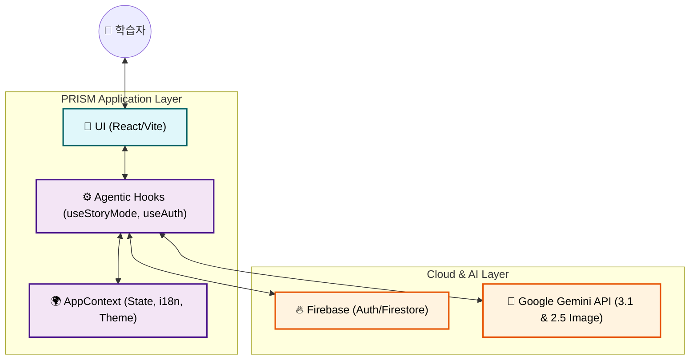
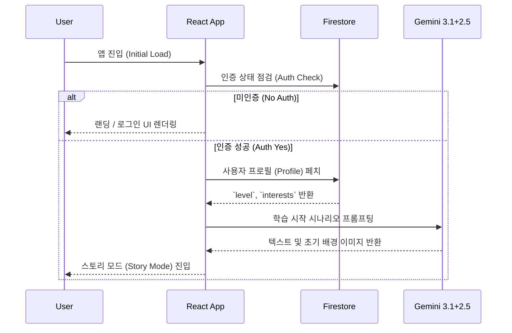

  
  <h1>🏗 03. 시스템 아키텍처 설계</h1>
  
<b>프론트엔드, AI 인텔리전스 레이어, 클라우드 인프라 간의 상호작용</b>

 

'PRISM — AI 기반 인터랙티브 교과서'의 시스템 컴포넌트, 데이터 흐름, 핵심 서비스인 AI 듀얼 엔진 구조 및 주요 기술적 의사결정(ADR)을 명세합니다.

---

## 🏢 1. 하이레벨 아키텍처 (Layered Architecture)

전통적인 클라이언트-서버 패턴에서 벗어나, 서비리스(Serverless) 및 에이전틱 훅(Agentic Hooks) 패턴을 활용합니다.

---

## 🔄 2. 데이터 흐름 및 상태 관리 (Data & State Flow)

### 📦 2.1 전역 컨텍스트 (`AppContext`)
- `selectedCountry`: 국가 분기 코드 (ex. `kr`, `us`)
- `selectedSchoolLevel`: 학교급 분기 (`elementary` / `middle` / `high`) — 프롬프트 길이나 UI 난이도 튜닝에 결합.
- `t`: 실시간 다국어 번역 Proxy Function.
- `curriculum`: 지역 및 대상자에 맞춘 최종 커리큘럼 트리 주입.

### ⏳ 2.2 핵심 라이프사이클 (Application Lifecycle)
인증에서부터 게임 루프까지 이어지는 메인 시퀀스입니다.

---

## 🤖 3. 에이전틱 스토리 엔진 (Agentic Story Engine)

> [!NOTE]  
> 단일 모델 풀링의 한계를 극복하기 위해 역할을 분리한 **Multi-Model Strategy** 방식을 채택했습니다.

| 두뇌 (Brain) | 모델 (Model) | 주요 역할 (Roles) | 응답형태 |
| :--- | :--- | :--- | :--- |
| **Primary Brain** | `Gemini 3.1 Flash` | 스토리 텍스트, 분기점 결과 생성, 퀴즈 출제 로직, 다음 이미지 생성 프롬프트 엔지니어링 | JSON / Markdown |
| **Visual Brain** | `Gemini 2.5 Flash Image` | Primary Brain이 구상한 장면/맥락을 받아서 실시간 상황에 맞는 16:9 배경 이미지 렌더링 | Base64 Image |

---

## ⚖️ 4. 기술적 의사결정 기록 (ADR: Architecture Decision Records)

설계 관점에서의 중요한 선택 프로세스와 사유를 아카이브합니다.

### 📌 ADR 001: 듀얼 AI 모델 전략
- **배경 (Context)**: 텍스트와 이미지 생성 레이턴시 차이로 인한 사용자 경험 저하.
- **결정 (Decision)**: 논리를 짤 때는 속도가 빠른 3.1 Flash, 시각화 시에는 정교한 2.5 Flash Image로 병행 처리.

### 📌 ADR 002: 업적 판단 로직 (Achievements)
- **배경 (Context)**: 달성 트리거를 클라이언트에서 판단할지, AI가 응답으로 돌려줄지 고민.
- **결정 (Decision)**: **하이브리드 분산**. AI는 텍스트 결과와 함께 메타데이터(힌트/키워드)만 생성하고, 클라이언트의 상태관리 훅(`useStoryProgress`)이 이를 포착하여 Firestore에 업데이트 및 배지 렌더링 수행.

### 📌 ADR 003: i18n 및 국가별 커리큘럼 배포
- **배경 (Context)**: 전 세계 8개국 288개 모듈 전체를 하나의 번들로 묶으면 앱 초기 로딩이 급등함.
- **결정 (Decision)**: 정적 Lazy Loading. 국가 코드 단위로 쪼갠 `curriculums/*` 파일을 분리하여, 사용자가 프로필에서 선택한 지역 데이터만 가져와서 렌더링.

---

  <b><a href="./02_REQUIREMENT_ANALYSIS.md">← 이전: 02. 요구사항 분석서</a> &nbsp;|&nbsp; <a href="./04_DESIGN_SYSTEM_SPEC.md">다음: 04. 디자인 규격 →</a></b>

