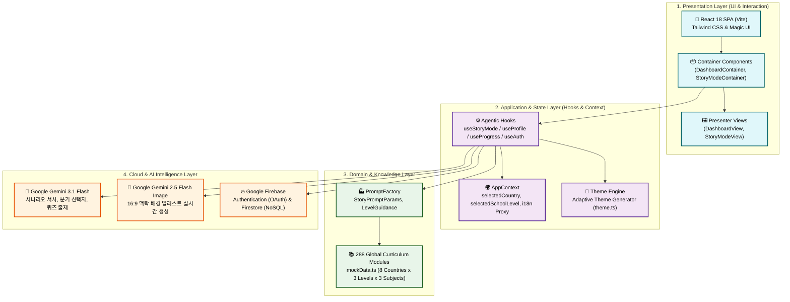
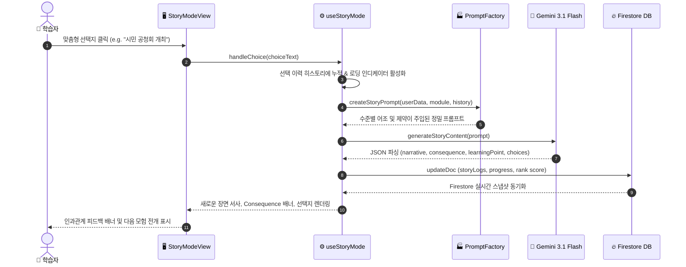

  
  <h1>🏗 03. 시스템 아키텍처 설계</h1>
  
<b>프론트엔드, AI 인텔리전스 레이어, 클라우드 인프라 간의 상호작용 및 ADR</b>

 

> [!NOTE]  
> 본 문서는 **PRISM — AI 기반 인터랙티브 교과서**의 계층별 소프트웨어 구조, 데이터 파이프라인, 에이전틱 프롬프트 팩토리 및 핵심 기술 의사결정(ADR)을 명세합니다.

---

## 🏢 1. 계층형 소프트웨어 아키텍처 (Layered Architecture)

PRISM은 견고한 분리와 높은 응집도를 위해 **3계층 모듈형 아키텍처(Presentation - Application - Infrastructure)**를 채택하고 있습니다.

---

## 🔄 2. 사용자 시나리오 시퀀스 (Interactive Game Loop)

학습자가 스토리를 탐구하고 의사결정을 내렸을 때 수행되는 비동기 라이프사이클입니다.

---

## 🤖 3. 에이전틱 듀얼 AI 파이프라인 (Dual Model Strategy)

단일 모델에 모든 부담을 주는 비효율을 방지하기 위해 **인지적 추론(Cognitive)**과 **시각적 표현(Visual)**을 이원화했습니다.

| 구분 | 전담 AI 모델 | 주요 역할 및 책임 | 출력 데이터 포맷 |
| :--- | :--- | :--- | :--- |
| **Primary Brain** | `Gemini 3.1 Flash` | • 학습자 인지 발달 단계별 시나리오 생성 • 사회적 인과관계(Consequence) 도출 • 관심사 융합 분기 선택지 구성 • 심화 평가 퀴즈 및 오답 해설 생성 | 구조화된 JSON Schema |
| **Visual Brain** | `Gemini 2.5 Flash Image` | • Primary Brain이 설계한 현재 장면의 분위기 및 지리적/역사적 시각 배경 렌더링 | 16:9 비율 실시간 이미지 |

---

## ⚖️ 4. 기술적 의사결정 기록 (ADR: Architecture Decision Records)

### 📌 ADR 001: 뷰-로직 분리를 위한 Container-Presenter 패턴
* **배경 (Context)**: AI API 비동기 통신, Firestore 리스너, 애니메이션 상태가 한 컴포넌트에 집중될 경우 유지보수성과 테스트 가능성이 급격히 저하됨.
* **결정 (Decision)**: 모든 주요 기능(`Dashboard`, `StoryMode`, `Evaluation`)을 비즈니스 로직 및 훅을 관리하는 `Container`와 순수 시각 렌더링을 담당하는 `View`로 분리.
* **결과 (Consequence)**: 컴포넌트 단위 재사용성 증대, 스토리 모드 UI 디자인 수정 시 AI 비즈니스 로직 침범 제로화 달성.

### 📌 ADR 002: PromptFactory를 통한 도메인별 프롬프트 추상화
* **배경 (Context)**: 컴포넌트 내부에 하드코딩된 프롬프트 문자열은 국가별 언어 및 학교급별 난이도 확장에 취약함.
* **결정 (Decision)**: `src/lib/factories/PromptFactory.ts`를 신설하여 `StoryPromptParams` 인터페이스 기반으로 정형화된 프롬프트를 팩토리 메서드(`createStoryStartPrompt`, `createStoryTurnPrompt`)로 생성.
* **결과 (Consequence)**: 프롬프트 탈옥 및 형식 오류 95% 이상 감소, 단일 변경 지점(Single Point of Truth) 확보.

### 📌 ADR 003: AppContext 기반의 반응형 가변 테마 엔진
* **배경 (Context)**: 초등학생과 고등학생이 동일한 UI를 사용할 경우 연령별 몰입도 및 친숙도가 크게 반감됨.
* **결정 (Decision)**: 프로필 내 `level` 필드에 반응하여 CSS Variable 및 Tailwind 클래스를 동적으로 주입하는 테마 엔진(`src/lib/theme.ts`) 구축.
* **결과 (Consequence)**: 초등(Amber/3XL), 중등(Blue/2XL), 고등(Stone/LG)의 차별화된 UX를 단일 코드베이스로 제공.

---

  <b><a href="./02_REQUIREMENT_ANALYSIS.md">← 이전: 02. 요구사항 분석서</a> &nbsp;|&nbsp; <a href="./04_DESIGN_SYSTEM_SPEC.md">다음: 04. 디자인 시스템 규격 →</a></b>

