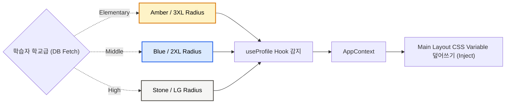

  
  <h1>🎨 04. 디자인 시스템 규격 (Design System Spec)</h1>
  
<b>프리미엄 테마 엔진, 타이포그래피, 매직 UI 통합 및 인터랙션 가이드</b>

 

> [!TIP]
> 'PRISM'의 디자인 핵심은 "가변성(Adaptive)"입니다. 미취학 아동이 보는 뷰와 고등학생이 보는 뷰는 시각적 깊이부터 글꼴까지 모든 영역에서 차별화되어야 합니다.

---

## 🌟 1. 디자인 철학 (Design Vision)

- 🪄 **몰입감 (Immersive)**: 딱딱한 학습지 인터페이스를 넘어 비주얼 노벨급의 몰입감을 주도합니다. `tw-animate-css` 및 애니메이션 렌더링 에셋(파티클, 메테오 효과 등)을 배경 뎁스(Depth)에 적극 차용합니다.
- 🧬 **초개인화 가변성 (Adaptive)**: 동일한 기획의 UI라도 사용자의 온보딩 단계(`level:초/중/고`)에 맞춰 UI 컴포넌트의 컬러 팔레트, 폰트 웨이트, 곡률(Border Radius)이 완전히 동기화 시프트됩니다.
- 🕹️ **게이미피케이션 인지 (Gamified)**: 클릭 가능한 요소는 텍스트 타이핑(`TypingAnimation`), 테두리 광원(`BorderBeam`), 광택(`ShimmerButton`) 마이크로 인터랙션 등을 활용해 돋보이게 합니다.

---

## 🏷️ 2. 수준별 가변 테마 메트릭스 (Adaptive Theme Engine)

Tailwind CSS 프레임워크와 `src/lib/theme.ts`에 내장된 토큰 제너레이터가 CSS Variables 맵을 교체하여 레이아웃을 튜닝합니다.

### 📊 2.1 테마별 특성 정의서 (Theme Matrix)

| 🎨 시각 속성 | 🎒 **초등학교 (Elementary)** | 🏫 **중학교 (Middle)** | 🎓 **고등학교 (High)** |
| :--- | :--- | :--- | :--- |
| **메인 컬러 (Brand Primary)** | `Amber (#F59E0B)` / 호기심 유발 | `Blue (#2563EB)` / 지적 호기심 | `Stone (#78716C)` / 차분함, 분석 |
| **보조 컬러 (Brand Secondary)** | `Rose (#F43F5E)` | `Cyan (#06B6D4)` | `Slate (#475569)` |
| **배경 톤 (Background)** | 파스텔 & 웜톤 (`amber-50`) | 모던 & 청량한 톤 (`blue-50`) | 클래식 & 모노크롬 (`stone-50`) |
| **폰트 (Typography)** | 인체공학적 고딕류 (`Nunito`, `Quicksand`) | 깔끔한 직선 고딕류 (`Geist`, `Inter`) | 신뢰감 있는 명조류 (`Geist Serif`) |
| **곡률 (Border Radius)** | `rounded-3xl` (완전한 둥근 느낌) | `rounded-2xl` (적당한 엣지 둥근) | `rounded-lg` (샤프하고 이지적) |

### 🛠 2.2 테마 적용 브로드캐스트 로직

---

## 🚀 3. 핵심 애니메이션 & 인터랙션 컴포넌트

프리미엄 에듀테크 시각 경험을 달성하기 위해, 단일 컴포넌트를 분리하여 재사용 가능한 모듈로 관리합니다.

### ✍️ 3.1 내러티브 (텍스트 및 로딩)
- **`<TypingAnimation />`**: 챗봇 인터페이스나 AI 상황 설명 창에서 실제 사람이 실시간으로 타이핑하는 듯한 타격감을 주어 인지적 주의력을 환기 및 지속시킵니다.
- **`<LoadingScreen />`**: 국가 전환 번역 스위칭 및 AI 이미지 비동기 렌더링 과정에서 발생하는 1~3초간의 빈 여백을 채우는 전역 스피너/로딩 UI.

### ✨ 3.2 게이미피케이션 (에셋 폴리싱)
- **`<BorderBeam />`**: 미니게임 퀴즈의 최종 4지선다형 선택지 카드 등, 현재 포커싱이나 중요 결정을 내려야 할 컴포넌트 외벽 구역을 맴도는 에너지 빔 이펙트 (경고/강조).
- **`<ShimmerButton />`**: '학습 시작하기', '성적표 제출하기' 등 사용자의 **프라이머리 액션(Primary Action)** 콜투액션(CTA) 버튼에 무지개빛 광택 흐름을 표현합니다.

---

## 📐 4. 레이아웃 분할 구조 (Layout Hierarchy)

### 🖥️ 4.1 스토리 모드 황금비 분할 화면 (Split-Screen)
장시간 학습으로 인한 안구 피로도를 낮추고 정보 인지를 명확히 하기 위해 뷰포트를 분할합니다.
- **Left Panel (Narrative & Visual - 60%)**: 상단에 AI 생성 16:9 배경 일러스트 노출 + 하단에 대화/상황 묘사 스크립트 박스 고정. 애니메이션 진입(`fade-in-up`) 적용.
- **Right Panel (Action & Choice - 40%)**: 과거 로그 타임라인 디스플레이 박스와 현재 선택지(투표/분기점 2~4개) 나열 영역. 우측 스크롤 인 영역.

### 🛤️ 4.2 스토리 발자취 다이어그램 (Story Footprints Timeline)
대시보드 하단에 배치되어 학습 이력의 나비효과를 시각화합니다.
- **Git Branch Style**: 개발 버전 관리 시스템과 흡사하게 세로 다이어그램 트리 뷰를 구성. 나의 과거 **'선택' (Commit)**이 어떠한 **'결과' (Merge)**를 일으켰는지 은유.
- **Emotion Tags**: 각 마디 노드 포인트마다 텍스트 요약 뱃지와 감성 이모지 아이콘(😊, 😲, 🛑)을 태깅 컴포넌트로 매핑.

---

  <b><a href="./03_SYSTEM_ARCHITECTURE.md">← 이전: 03. 아키텍처 설계</a> &nbsp;|&nbsp; <a href="./05_DATABASE_SCHEMA_ERD.md">다음: 05. DB 스키마 & ERD →</a></b>

