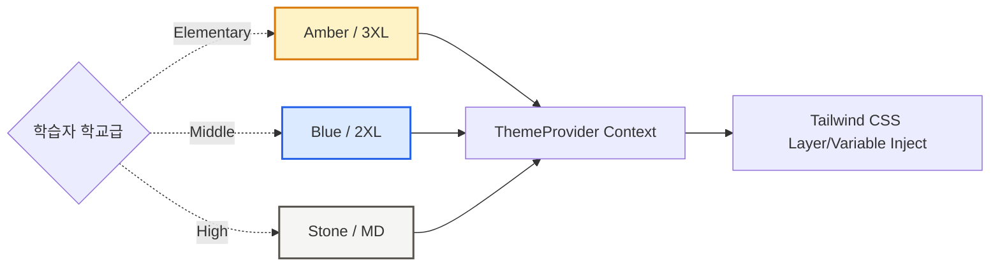

  
  <h1>🎨 04. 디자인 시스템 규격</h1>
  
<b>프리미엄 테마 엔진, 타이포그래피 및 Magic UI 통합 가이드</b>

 

'PRISM'의 디자인 철학과 수준별로 변동되는 가변 테마(Adaptive Theme) 지침, 그리고 상호작용(Interaction) 컴포넌트의 명세를 기록합니다.

---

## 🌟 1. 디자인 철학 (Design Vision)

- 🪄 **몰입감 (Immersive)**: 단순한 뷰어를 넘어, 비주얼 노벨급의 몰입감을 위해 `Magic UI` 에셋(파티클, 메테오 효과 등)을 배경에 적극 차용.
- 🧬 **가변성 (Adaptive)**: 동일한 기능의 UI라도, 사용자의 학교급(`level`)에 맞춰 컬러 팔레트, 폰트 종류, 곡률(Border Radius)이 완전히 동기화되어 '초개인화' 느낌을 배가.
- 🕹️ **게이미피케이션 (Gamified)**: 밋밋한 버튼 클릭에서 탈피하여 텍스트 타이핑(`TypingAnimation`), 테두리 광원(`BorderBeam`), 버튼 광택(`ShimmerButton`) 등을 활용.

---

## 🏷️ 2. 수준별 가변 테마 엔진 (Adaptive Theme Engine)

`src/lib/theme.ts`에 내장된 토큰 제너레이터는 학습자의 프로필 메타데이터(`level`)에 반응하여 전체 CSS Variables 조율을 수행합니다.

### 📊 2.1 테마별 특성 (Theme Matrix)

| 구분 요약 | 🎒 **초등학교 (Elementary)** | 🏫 **중학교 (Middle)** | 🎓 **고등학교 (High)** |
| :--- | :--- | :--- | :--- |
| **메인 컬러 (Brand)** | `Amber (#F59E0B)` / 따뜻함 | `Blue (#2563EB)` / 지적임 | `Stone (#78716C)` / 성숙함 |
| **배경 톤 (Bg)** | 파스텔 & 따뜻한 톤 (`amber-50`) | 모던 & 청량한 톤 (`blue-50`) | 클래식 & 모노크롬 (`stone-50`) |
| **타이포그래피** | 동글동글한 고딕류 (`Inter`) | 깔끔한 직선 고딕류 (`Geist`) | 신뢰감 있는 명조류 (`Geist Serif`) |
| **곡률 (Radius)** | `rounded-3xl` | `rounded-2xl` | `rounded-lg` |

### 🛠 2.2 테마 적용 로직 (Flow)

---

## 🚀 3. 핵심 상호작용 컴포넌트

프리미엄 에듀테크 경험을 위해 외부 애니메이션 라이브러리를 아키텍처에 병합하여 재사용 가능한 모듈로 구축했습니다.

### ✍️ 3.1 텍스트 및 로딩
- `<TypingAnimation />`: 챗봇이나 대화창에서 실제 사람이 타이핑하는 듯한 타격감을 주어 인지적 주의력을 환기.
- `<LoadingScreen />`: 번역 스위칭 및 AI 비동기 요청 과정에서 1~3초간 체류 시 노출되는 글로벌 트랜지션 UI.

### ✨ 3.2 게이미피케이션 에셋
- `<BorderBeam />`: 미니게임 퀴즈 선택지 등, 현재 포커싱 되어야 할 컴포넌트 주변을 맴도는 에너지 빔 이펙트.
- `<ShimmerButton />`: 로그인, 대시보드 진입, 최종 완료 등 사용자의 **프라이머리 액션(Primary Action)** 콜투액션(CTA) 버튼을 도드라지게 표현.
- `<MagicCard />`: 대시보드 통계 카드 등에 호버(Hover) 시, 3D 입체감과 동적 그라데이션 글로우(Glow) 효과를 추가.

---

## 📐 4. 레이아웃 구조 (Layout Hierarchy)

### 🖥️ 4.1 스토리 모드 분할 레이아웃 (Split-Screen)
스토리 전개 및 인터랙션 피로도를 낮추기 위해 화면을 황금비율로 나눕니다.
- **Left Panel (Narrative & Visual)**: AI 생성 배경 일러스트 + 하단의 대화/상황 스크립트 출력.
- **Right Panel (Action & Choice)**: 사용자 선택지(투표/분기점), 이전 선택 결과 요약 배너, 미니게임 컨테이너.

### 🛤️ 4.2 분기 타임라인 추적 (Story Footprints)
대시보드 하단에 배치되는 '나의 행보' 시각화 컴포넌트입니다.
- **Git Branch Style**: 깃허브 커밋 트리 형태로 세로 다이어그램 바를 구성하여, 원인(선택)과 결과(나비효과)를 시각적으로 은유.
- **Status Tags**: 각 노드 포인트마다 요약 텍스트와 감성 아이콘을 태깅.

---

  <b><a href="./03_SYSTEM_ARCHITECTURE.md">← 이전: 03. 아키텍처 설계</a> &nbsp;|&nbsp; <a href="./05_DATABASE_SCHEMA_ERD.md">다음: 05. DB 스키마 & ERD →</a></b>

