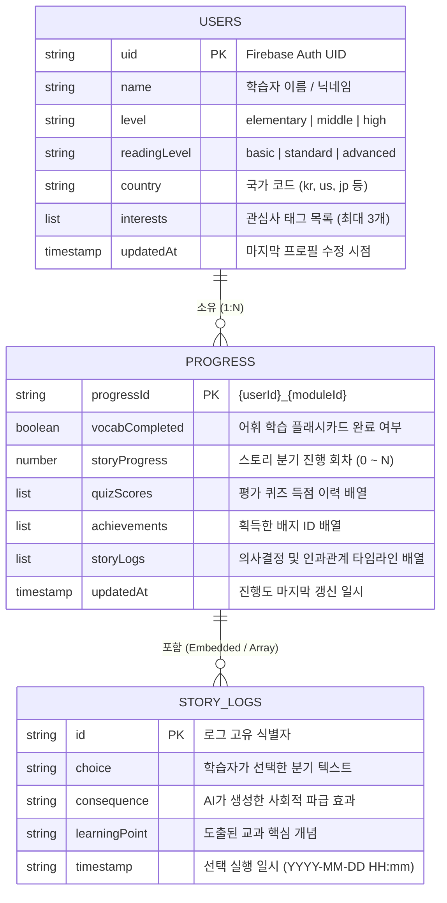

<div align="center">
  
  <h1>🗄 05. 데이터베이스 스키마 & ERD</h1>
  <p><b>PRISM 학습 데이터 프로토콜 및 관계 명세서</b></p>
</div>

<br/>

> [!NOTE]  
> 본 모델링 가이드는 관계형 RDBMS 개념 모델을 기반으로 하되, 실제 프로덕션 구현체인 Google Firebase Firestore의 **NoSQL 문서/컬렉션(Document/Collection)** 구조와 보안 규칙(`firestore.rules`)을 상세 기술합니다.

---

## 📊 1. 엔티티 관계도 (Entity-Relationship Diagram)

Firestore NoSQL 데이터 모델은 사용자 중심의 `users` 컬렉션과 모듈 단위의 `progress` 컬렉션으로 구성되어 있으며, 각 진행도 내부에 세부 스토리 로그와 퀴즈 득점 이력이 원자적으로 보존됩니다.



---

## 📂 2. 주요 컬렉션 상세 설계 (NoSQL Collections)

### 👤 2.1 `users/{userId}` 컬렉션
> 학습자 페르소나, 인지 수준, AI 프롬프트 주입의 원천 소스로 기능합니다.

| 필드명 (Field) | 데이터 타입 | 필수 여부 | 상세 설명 (Description) |
| :--- | :---: | :---: | :--- |
| `name` | `string` | 필수 | 학습자 닉네임 (1~100자). 서사 내 주인공 호칭으로 활용. |
| `level` | `string` | 필수 | 학교급 (`elementary` / `middle` / `high`). AI 난이도 및 UI 테마 조절. |
| `readingLevel` | `string` | 선택 | 읽기 난이도 (`basic` / `standard` / `advanced`). 기본값 `standard`. |
| `country` | `string` | 필수 | 국가 코드 (`kr`, `us`, `jp` 등). 커리큘럼 기준 지표. |
| `interests` | `list<string>`| 필수 | 학습자 관심사 태그 배열 (예: `["우주 과학", "민주주의", "AI 로봇"]`). |
| `updatedAt` | `timestamp` | 필수 | 마지막 프로필 업데이트 시각 (ISOString 또는 Firestore Timestamp). |

---

### 📈 2.2 `progress/{progressId}` 컬렉션
> 각 학습자(`userId`)와 모듈(`moduleId`)의 복합 키(`{userId}_{moduleId}`)로 저장되는 학습 진도 마스터 노드입니다.

| 필드명 (Field) | 데이터 타입 | 필수 여부 | 상세 설명 (Description) |
| :--- | :---: | :---: | :--- |
| `vocabCompleted` | `boolean` | 필수 | 어휘 학습 완료 여부 (대시보드 점수 20점 배점). |
| `storyProgress` | `number` | 필수 | 완료한 스토리 분기 턴 수 (최대 40점 배점). |
| `quizScores` | `list<number>`| 필수 | 심화 평가 퀴즈 점수 목록 (최고 득점 기준 최대 40점 배점). |
| `achievements` | `list<string>`| 필수 | 획득한 특수 배지 ID 목록 (예: `["first_step", "law_guardian"]`). |
| `storyLogs` | `list<map>` | 필수 | 의사결정 타임라인('나의 스토리 발자취') 객체 배열. |
| `updatedAt` | `timestamp` | 필수 | 학습 진도 마지막 갱신 시각. |

---

### 📜 2.3 `storyLogs` 데이터 구조 (Embedded Log)

```json
{
  "id": "log-1712984012345",
  "choice": "시민 공청회를 개최하여 주민들의 의견을 직접 수렴한다",
  "consequence": "주민들의 다양한 요구와 갈등을 파악하고 직접 민주주의의 가치를 깨달았습니다.",
  "learningPoint": "의사결정 과정에서 대중 참여와 절차적 정당성의 중요성",
  "timestamp": "2026-04-12 14:20"
}
```

---

## 🔐 3. 보안 규칙 및 인가 정책 (Firestore Security Rules)

`firestore.rules`를 통해 엄격한 RBAC(Role-Based Access Control) 및 소유권 기반 격리를 적용하고 있습니다.

1. **소유자 기반 접근 제어 (Owner Isolation)**:
   * 모든 사용자는 자신의 `request.auth.uid`와 일치하는 문서에만 읽기 및 쓰기 권한을 가집니다.
   * 타인의 프로필이나 진행도(`progress`)에 대한 무단 열람 및 위변조가 원천 차단됩니다.
2. **엄격한 스키마 유효성 검증 (Schema Validation)**:
   * `level` 필드는 반드시 `['elementary', 'middle', 'high']` 중 하나여야 합니다.
   * `name` 길이는 1~100자로 제한되며, `interests` 배열 크기 및 `storyLogs` 최대 항목 수(1,000개)가 강제됩니다.

---

<div align="right">
  <b><a href="./04_DESIGN_SYSTEM_SPEC.md">← 이전: 04. 디자인 시스템 규격</a> &nbsp;|&nbsp; <a href="./06_IMPLEMENTATION_DETAIL.md">다음: 06. 구현 상세 및 아키텍처 실무 (Next) →</a></b>
</div>
