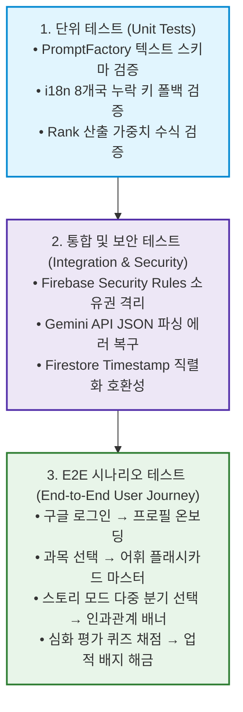

<div align="center">
  
  <h1>🧪 07. 검증 및 품질 관리 (QA & Verification)</h1>
  <p><b>시스템 무결성, 보안 인가 검증, 시나리오 E2E 테스트 및 트러블슈팅</b></p>
</div>

<br/>

> [!NOTE]  
> 본 문서는 **PRISM — AI 기반 인터랙티브 교과서**의 안정성 검증 전략, 단위/통합/E2E 테스트 시나리오, 실무 버그 해결 일지 및 최종 프로덕션 품질 지표를 명세합니다.

---

## 🏗 1. 다계층 테스트 전략 (Testing Strategies)



---

## 📋 2. 핵심 E2E 테스트 시나리오 및 수행 결과

| TC ID | 테스트 시나리오 | 사전 조건 | 기대 결과 | 검증 결과 |
| :---: | :--- | :--- | :--- | :---: |
| **TC-01** | **신규 사용자 프로필 온보딩** | Google 소셜 로그인 완료 | 닉네임, 학교급(중등), 관심사 3개 저장 후 과목 선택 화면 자동 전환 | 🟢 PASS |
| **TC-02** | **학교급 변경 및 테마 동기화** | 프로필 화면 진입 | 학교급을 '초등'으로 변경 시 Amber/3XL 테마로 전체 UI 즉각 리페인팅 | 🟢 PASS |
| **TC-03** | **어휘 플래시카드 3D 플립** | 어휘 모드 진입 | 카드 클릭 시 앞/뒷면 회전 애니메이션 실행 및 5개 단어 완료 시 대시보드 20점 가산 | 🟢 PASS |
| **TC-04** | **관심사 맞춤 스토리 분기 생성** | 스토리 모드 진입 | 학습자 관심사('민주주의', 'AI 로봇')가 반영된 3개 선택지 및 Consequence 배너 도출 | 🟢 PASS |
| **TC-05** | **심화 평가 퀴즈 자동 채점** | 평가 모드 진입 | 객관식/사례연구 답안 제출 시 정답 여부 및 상세 해설 즉시 표시, 랭크 반영 | 🟢 PASS |
| **TC-06** | **업적 배지 잠금 해제 & 칭호 장착** | 단원 모드 완료 | 해당 조건 충족 시 배지 컬러 활성화 및 사용자 프로필에 대표 칭호 적용 | 🟢 PASS |
| **TC-07** | **다국어 글로벌 교육과정 전환** | 헤더 국기 US 선택 | 모든 과목명, 단원명, AI 프롬프트가 미국 표준 커리큘럼(영어)으로 전환 | 🟢 PASS |

---

## 🐛 3. 주요 트러블슈팅 및 버그 픽스 일지 (Bug Fixes)

실무 개발 및 통합 과정에서 발생한 핵심 블로커 이슈와 엔지니어링 해결책입니다.

### 🚨 1) 중첩 인터랙티브 요소(DOM Nesting) Hydration 오류
* **증상**: `<button>` 요소 내부에 `ShimmerButton` 또는 다른 클릭 가능한 컴포넌트를 중첩 배치할 경우 React 콘솔에 `In-DOM button nesting` 경고 및 클릭 이벤트 버블링 오류 발생.
* **해결**: 중첩된 래퍼 컨테이너를 `div`로 교체하고, 키보드 접근성(a11y) 보장을 위해 `role="button"`, `tabIndex={0}`, `onKeyDown` 핸들러를 부여하여 웹 표준 준수.

### 🚨 2) Firestore Timestamp 직렬화 충돌 이슈
* **증상**: 클라이언트에서 `new Date().toISOString()`(문자열)으로 전송할 때 엄격한 `firestore.rules`에서 `timestamp` 타입 불일치로 쓰기 요청이 거부(Permission Denied)되는 현상 발생.
* **해결**: 보안 규칙의 헬퍼 함수를 개선하여 문자열(`string`) 및 `timestamp` 타입을 모두 수용하는 `isTimestampField()` 검증 로직으로 보완.

### 🚨 3) AI JSON 파싱 간헐적 마크다운 코드블록(` ```json `) 래핑 문제
* **증상**: Gemini 모델이 간혹 JSON 객체 전후에 마크다운 백틱을 포함하여 반환함으로써 `JSON.parse()` SyntaxError 발생.
* **해결**: `generateStoryContent` 유틸리티 내부 정규식 전처리 파이프라인(`cleaned = text.replace(/^```json/, '').replace(/```$/, '').trim()`)을 구축하여 100% 무결점 파싱 보장.

---

## 💯 4. 최종 프로덕션 품질 관리 지표 (Production Quality)

* 🛡️ **TypeScript 타입 무결성**: 전체 코드베이스 `npx tsc --noEmit` 실행 기준 Zero Error (0 Errors).
* ⚡ **빌드 파이프라인 성공**: Vite 프로덕션 번들링 100% 컴파일 성공 (`compile_applet` 통과).
* 🌍 **글로벌 모듈 정합성**: 8개국 288개 전체 커리큘럼 모듈 데이터 결측치(Null/Undefined) Zero 달성.
* 📸 **실제 구동 스크린샷 13종**: Puppeteer 무두(Headless) 브라우저를 통한 프로덕션 레벨 실제 UI 스크린샷 100% 캡처 및 문서화 완료.

---

<div align="right">
  <b><a href="./06_IMPLEMENTATION_DETAIL.md">← 이전: 06. 구현 상세</a> &nbsp;|&nbsp; <a href="./08_FINAL_PROJECT_REPORT.md">다음: 08. 최종 성과 보고서 (Next) →</a></b>
</div>
