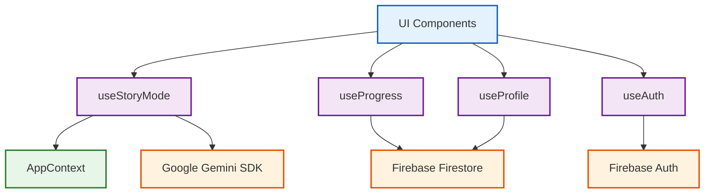

# 📑 PRISM: 시스템 API & 개발자 레퍼런스 (API Reference)

> **PRISM (Personalized Reading & Interactive Semantic Module)**  
> 프론트엔드 컴포넌트, 에이전틱 커스텀 훅, 컨텍스트 프로바이더, AI 및 Firebase SDK 인터페이스 명세서

---

## 🏗️ 1. 훅 의존성 구조도 (Hook Dependency Graph)



---

## 📦 2. 전역 상태 및 컨텍스트 (Context API)

### 2.1 `AppContext` (`src/contexts/AppContext.tsx`)

| 속성명 (Property) | 타입 (Type) | 상세 설명 (Description) |
| :--- | :--- | :--- |
| `selectedCountry` | `string` | 현재 활성화된 국가 코드 (`kr`, `us`, `jp`, `cn`, `gb`, `fr`, `it`, `de`). |
| `setSelectedCountry` | `(country: string) => void` | 활성 국가 코드를 변경하고 로컬스토리지에 영구 저장하는 함수. |
| `selectedSchoolLevel` | `'elementary' \| 'middle' \| 'high'` | 학습자의 학교급 상태. |
| `setSelectedSchoolLevel` | `(level: SchoolLevel) => void` | 학교급을 변경하고 테마 및 모듈 트리를 갱신하는 함수. |
| `t` | `any` | 현재 국가/언어에 매핑된 실시간 다국어 번역 프록시 객체. |
| `currentCountry` | `CountryInfo` | 현재 국가의 국기 이모지, 명칭, 통화 단위 메타데이터. |
| `curriculum` | `CountryCurriculum` | 선택된 국가 및 학교급에 최적화된 정규 교육과정 지식 베이스. |
| `MODULES` | `Record<string, Module[]>` | 현재 학제에 매핑된 전체 모듈 목록. |

---

## 🪝 3. 에이전틱 커스텀 훅스 (Custom Hooks)

### 3.1 `useStoryMode(moduleId: string | undefined)`
비주얼 노벨 서사 생성, 의사결정 분기, Consequence 배너 피드백을 총괄하는 핵심 엔진입니다.

```typescript
interface StoryModeHookReturn {
  profile: any;                       // 학습자 프로필 객체
  loading: boolean;                   // 초기 데이터 로딩 여부
  generating: boolean;                // AI 시나리오/이미지 생성 진행 중 여부
  consequence: { narrative: string; learningPoint: string }; // 직전 선택에 따른 인과관계
  storyText: string;                  // 현재 장면의 본문 서사
  imageUrl: string | null;            // 16:9 배경 일러스트 URL
  choices: Array<{ text: string; tailoredInterest?: string; learningOutcome?: string }>; // 분기 선택지
  isEnding: boolean;                  // 멀티 엔딩 에필로그 진입 여부
  endingSummary: string;              // 여정 종합 평가
  handleChoice: (choiceText: string) => Promise<void>; // 사용자 선택 처리 핸들러
}
```

---

### 3.2 `useProgress(uid: string | undefined, moduleId: string | undefined)`
Firestore `progress/{uid}_{moduleId}` 문서와 양방향 실시간 동기화를 수행합니다.

```typescript
interface ProgressHookReturn {
  progress: {
    vocabCompleted: boolean;         // 어휘 학습 완료 여부
    storyProgress: number;           // 진행한 스토리 분기 턴 수
    quizScores: number[];            // 퀴즈 응시 점수 배열
    achievements: string[];          // 달성한 특수 배지 ID 배열
    storyLogs: StoryLog[];           // 의사결정 타임라인 로그 배열
    updatedAt: string;
  } | null;
  loading: boolean;
}
```

---

### 3.3 `useProfile(uid: string | undefined)`
학습자 개인 메타데이터를 관리합니다.

```typescript
interface ProfileHookReturn {
  profile: {
    name: string;                    // 학습자 닉네임
    level: 'elementary' | 'middle' | 'high';
    readingLevel: 'basic' | 'standard' | 'advanced';
    interests: string[];             // 관심사 태그 목록 (최대 3개)
    country: string;
  } | null;
  loading: boolean;
  updateProfile: (data: Partial<UserProfile>) => Promise<void>;
}
```

---

## 🏭 4. 도메인 팩토리 & AI 서비스 (AI Services)

### 4.1 `PromptFactory` (`src/lib/factories/PromptFactory.ts`)

| 정적 메서드 (Static Method) | 매개변수 (Params) | 설명 (Description) |
| :--- | :--- | :--- |
| `createStoryStartPrompt` | `StoryPromptParams` | 단원의 1회차 도입부 시나리오 및 관심사 맞춤 선택지를 요청하는 시스템 프롬프트 생성. |
| `createStoryTurnPrompt` | `StoryPromptParams` | 직전 선택(`choiceText`)과 누적 히스토리를 반영하여 인과관계와 다음 분기를 요청하는 프롬프트 생성. |
| `getLevelGuidance` | `level, readingLevel` | 초/중/고별 문장 길이, 어휘 난이도, 어조(해요체/하십시오체) 메타 규칙을 문자열로 반환. |

---

### 4.2 `gemini.ts` (`src/lib/gemini.ts`)

```typescript
// Gemini 3.1 Flash를 통한 JSON 서사 생성
export async function generateStoryContent(prompt: string): Promise<string>;

// Gemini 2.5 Flash Image를 통한 16:9 맥락 배경 일러스트 렌더링
export async function generateImage(prompt: string): Promise<string | null>;
```

---

## 🎨 5. 디자인 시스템 테마 유틸리티 (`src/lib/theme.ts`)

```typescript
export function getLightTheme(level: string): {
  card: string;       // Tailwind 클래스 (배경 및 경계선)
  radius: string;     // 모서리 곡률 (rounded-3xl | rounded-2xl | rounded-lg)
  font: string;       // 타이포그래피 (font-sans | font-serif)
  accent: string;     // 강조 색상 클래스
  badge: string;      // 배지 뱃지 배경/텍스트 클래스
};
```

---

<div align="center">
  <b>PRISM — Personalized Reading & Interactive Semantic Module</b><br/>
  <i>API Reference v2.0 • 2026 PRISM Engineering Team</i>
</div>
