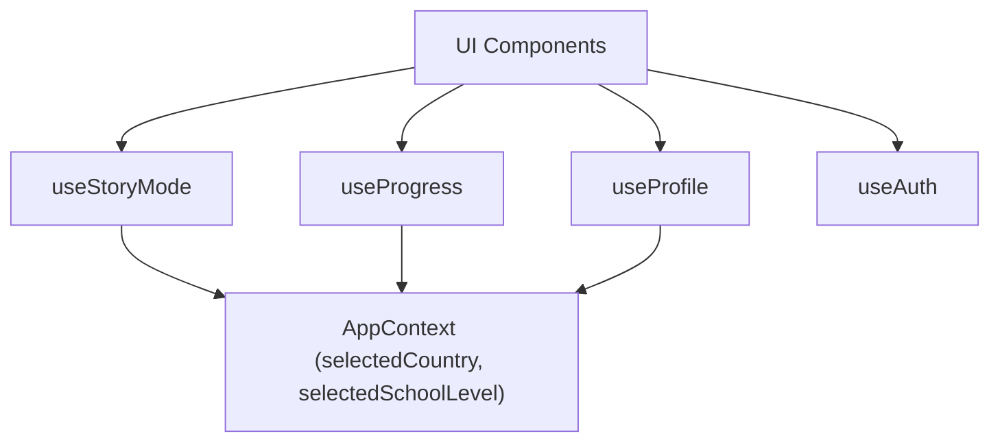
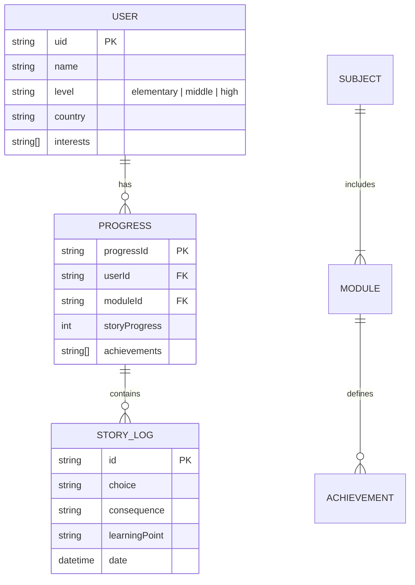

# 📑 PRISM: API Reference & Architecture

본 문서는 **'PRISM — AI 기반 인터랙티브 교과서'**의 핵심 API, 훅 의존성 및 데이터 도메인 명세를 상세히 기술합니다.

---

## 🏗️ 시스템 아키텍처 및 훅 의존성 (Hook Dependency Graph)



---

## 1. 전역 상태 및 컨텍스트 (Context API)

### 1.1. `AppContext` (`src/contexts/AppContext.tsx`)
애플리케이션 전반의 설정 및 국제화 데이터를 관리합니다.

**Properties:**
- `selectedCountry`: 현재 선택된 국가 코드 (String, `kr`|`us`|`jp`|`cn`|`gb`|`fr`|`it`|`de`).
- `t`: 다국어 번역 프록시 객체. `t.common.start`와 같이 계층 구조로 접근 가능.
- `curriculum`: 현재 국가 및 언어에 최적화된 과목/단원 데이터 트리.
- `user`: 현재 로그인된 Firebase User 객체.
- `profile`: Firestore에서 로드된 사용자 상세 프로필 (`UserProfileInterface`).
- `loading`: 초기 데이터 로딩 상태 (Boolean).

---

## 2. 인터랙티브 엔진 훅스 (Interactive Hooks)

### 2.1. `useStoryMode(moduleId)`
스토리 모드의 전체 라이프사이클을 관리하며 UI와 AI 엔진을 중계합니다.

**Return Values:**
- `storyText`: AI가 생성한 현재 장면의 이야기 텍스트.
- `choices`: 다음 단계를 위한 선택지 배열 (관심사 기반 특수 선택지 포함).
- `consequence`: 이전 선택에 따른 결과 텍스트 (Banner에 표시).
- `image`: Gemini 2.5 Image가 생성한 실시간 배경 (Base64 URL).
- `handleChoice(choiceText)`: 사용자의 선택을 AI 엔진에 전달하고 새로운 장면을 생성 요청하는 비동기 함수.

### 2.2. `useProgress()`
학습자의 진행 상황, 업적, 로그 데이터를 Firestore와 동기화합니다.

**Return Values:**
- `storyLogs`: 전체 학습 여정의 로그 배열.
- `achievements`: 획득한 배지 ID 배열.
- `rank`: 진행도를 기반으로 계산된 실시간 등급 (Bronze, Silver, Gold, Platinum, Diamond).
- `unlockAchievement(id)`: 특정 조건 달성 시 업적을 획득 처리하는 함수.

---

## 3. 데이터 도메인 명세 (`src/types.ts`)

### 3.1. 사용자 프로필 (`UserProfileInterface`)
```typescript
interface UserProfileInterface {
  name: string;        // 닉네임
  level: 'elementary' | 'middle' | 'high'; // 학교급 내부 키
  interests: string[]; // 관심사 태그 배열
  country: string;      // 소속 국가 코드
}
```

### 3.2. 스토리 로그 (`StoryLogInterface`)
```typescript
interface StoryLogInterface {
  choice: string;       // 사용자가 내린 선택
  consequence: string;  // 그로 인한 결과 (Consequence)
  learningPoint: string;// 교육적 핵심 포인트
  timestamp: string;    // 발생 시간 (ISOString)
}
```

---

## 4. 데이터 모델 관계도 (ERD)



---

## 5. AI 브릿지 (`src/lib/gemini.ts`)

- **`generateStoryContent(prompt)`**: 
    - **Schema**: `consequence`, `text`, `imagePrompt`, `choices`, `isEnding` 필드를 포함한 JSON 구조 강제.
    - **Temperature**: 0.7 (스토리텔링의 창의성과 일관성 사이의 균형).
- **`generateImage(prompt)`**:
    - **Model**: `gemini-2.5-flash-image`
    - **Params**: Aspect Ratio `16:9`, Output Type `Base64 inlineData`.

---

## 5. 백엔드 통합 (Firebase)

- **Firestore Rules**: 
    - `auth != null`인 사용자만 자신의 `uid`와 일치하는 문서에 접근 가능하도록 보안 구성.
    - `updateDoc`을 통한 부분 업데이트로 데이터 전송 효율성 극대화.

---
[뒤로 가기](../README.md)
