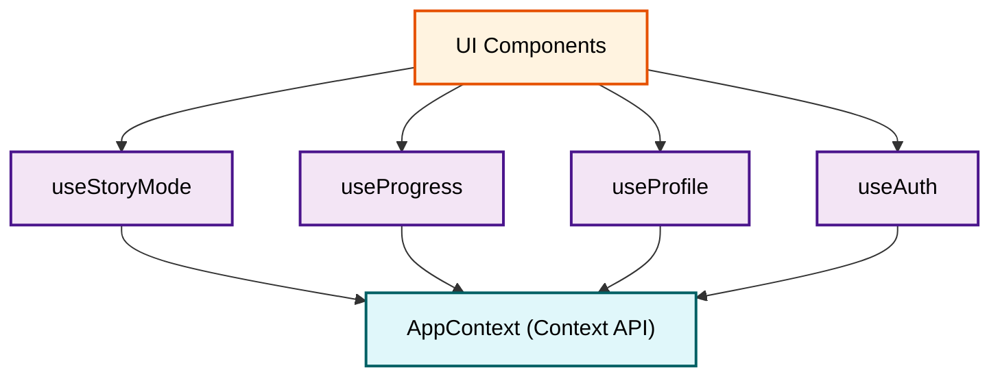

<div align="center">
  
  <h1>📑 PRISM: API Reference & Architecture</h1>
  <p><b>'PRISM — AI 기반 인터랙티브 교과서'의 핵심 API, 훅 설계 및 데이터 도메인 명세서</b></p>
</div>

<br/>

---

## 🏗️ 1. 시스템 아키텍처 및 훅 의존성 (Hook Dependency Graph)



---

## 🌍 2. 전역 상태 및 컨텍스트 (Context API)

### 2.1. `AppContext` (`src/contexts/AppContext.tsx`)
애플리케이션 전반의 국가별 설정 및 다국어 지원(i18n) 데이터를 관리하는 프로바이더입니다.

**Properties (상태 필드):**
- 🏳️ `selectedCountry`: 현재 선택된 국가 코드 (String, `kr`\|`us`\|`jp`\|`cn`\|`gb`\|`fr`\|`it`\|`de`).
- 🗣️ `t(key)`: 다국어 번역 프록시 함수. `t('common.start')` 형식으로 중첩된 JSON 딕셔너리 접근 가능.
- 📚 `curriculum`: 현재 국가 로케일에 최적화된 동적 커리큘럼 트리(과목/단원) 객체.
- 🏫 `selectedSchoolLevel`: 학생의 발달 단계 (`elementary`\|`middle`\|`high`).

---

## ⚙️ 3. 인터랙티브 엔진 훅스 (Interactive Hooks)

### 3.1. `useStoryMode(moduleId)`
가장 무거운 역할을 수행하는 메인 훅입니다. 스토리 턴과 AI 생성 라이프사이클을 조율합니다.

**Return Values:**
- 📜 `storyText`: AI가 생성한 현재 장면의 이야기 텍스트 (Markdown 가능).
- 🔀 `choices`: 다음 전개를 결정짓기 위한 선택지 문자열 배열. 유저 관심사가 결합된 특수 선택지가 포함될 수 있음.
- 📌 `consequence`: 유저의 직전 선택에 대해 AI가 내놓은 인과관계 분석 코멘트.
- 🖼️ `image`: Gemini 2.5 Image가 렌더링한 16:9 뷰포트 배경 에셋 (Base64 URL).
- 🚀 `handleChoice(choiceText: string) => Promise<void>`: 사용자의 선택을 AI 프롬프트 체인에 던지고, 응답을 디코딩하여 다음 장면 렌더를 트리거하는 클로저.

### 3.2. `useProgress()`
학습자의 학습 이력 저장, 업적 체크, 파이어베이스 동기화를 전담합니다.

**Return Values:**
- 📖 `storyLogs`: 전체 학습 여정의 타임라인 로그 배열 (`[{ choice, consequence, timestamp }]`).
- 🏅 `achievements`: 현재까지 획득 완료한 배지의 ID 배열.
- 👑 `rank`: 누적 퀴즈 점수 및 진척도를 기반으로 환산된 실시간 티어 문자열 (`Bronze` ~ `Diamond`).
- 🔓 `unlockAchievement(id: string)`: 조건 충족이 감지될 때 서버로 배지 소유권을 청구(UpdateDoc)하는 뮤테이션 함수.

---

## 🗄️ 4. 데이터 도메인 명세 (TypeScript Interfaces)

### 4.1. 사용자 프로필 (`UserProfileInterface`)
```typescript
interface UserProfileInterface {
  name: string;        // 닉네임
  level: 'elementary' | 'middle' | 'high'; // 연령대 기반 학교급
  interests: string[]; // 다중 관심사 태그 (최대 20자 제한)
  country: string;     // 접속 국가/서버 로케일 코드
  createdAt: string;   // 가입 시점 ISO 문자열
}
```

### 4.2. 스토리 진행 로그 (`StoryLogInterface`)
```typescript
interface StoryLogInterface {
  choice: string;       // 사용자가 화면에서 클릭한 선택지 텍스트
  consequence: string;  // 해당 선택이 불러온 파급 효과(AI 분석)
  learningPoint: string;// 세계관 속 교육적 배움/개념
  timestamp: string;    // 액션 타임스탬프 (ISO)
}
```

---

## 🤖 5. AI 인텔리전스 브릿지 (`src/lib/gemini.ts`)

- 🧠 **`generateStoryContent(prompt)`**: 
    - **Schema Bound**: 응답 포맷이 흐트러지지 않도록 System Instruction에 JSON Schema(키: `consequence`, `text`, `choices`, `isEnding`)를 강제 마운트함.
    - **Hyperparameter**: `Temperature: 0.7` (학습 목적에 부합하는 일관성을 지키면서도 판타지적 창의력을 발휘할 수 있는 황금비율).
- 🖼️ **`generateImage(prompt)`**:
    - **Model Core**: `gemini-2.5-flash-image`
    - **Config**: 뷰포트 종횡비 `aspectRatio: '16:9'`, 브라우저 렌더링 최적화를 위한 `outputMimeType: 'image/jpeg'`.

---

<div align="center">
  <b><a href="../README.md">🏠 README 메인으로 가기</a></b>
</div>
