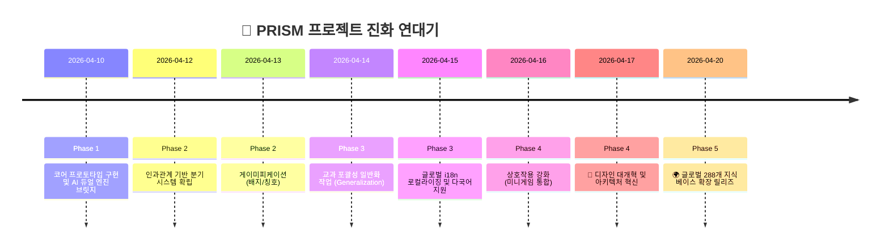

  
  <h1>📖 개발 일지 색인 (Development Log Index)</h1>
  
<b>PRISM 에듀테크 프로젝트의 역사와 기능 고도화 마일스톤 회고록</b>

 

> PRISM — AI 기반 인터랙티브 교과서 프로젝트의 탄생부터 글로벌 런칭 품질 확보까지, 엔지니어들의 땀방울이 밴 날짜별 마일스톤 색인입니다.

---

## 🗓️ 통합 마일스톤 타임라인 (Timeline)

---

## 📂 상세 일지 카테고리 (Detailed Logs)

### 🌱 1. 초기 토대 구축기 (Phase 1)
핵심 생성형 AI와 백엔드 서버리스 연결망이 구축된 시점입니다.
- 🔗 [**2026-04-10: MVP의 탄생**](./dev_log/2026-04-10_MVP.md)
    - Firebase Auth 및 Firestore 데이터모델 초기 연동.
    - Gemini 3.1 Pro (Logic) & 2.5 Flash Image (Vision) 듀얼 통합.
    - 초등학교 1종(민주주의 마을 모험) 프로토타입 서사망 완성.

### ⚔️ 2. 기능 및 인지 경험 고도화 (Phase 2)
학습 효과를 극대화하기 위한 '원인-결과' 시스템과 보상 루프가 기획 적용되었습니다.
- 🔗 [**2026-04-12: 분기점과 인과관계 배너**](./dev_log/2026-04-12_BRANCHING.md)
    - Non-linear 스토리 분기(Branching) 시스템 최적화.
    - AI 선택 결과 배너 (Consequence Feedback UI) 마운트.
- 🔗 [**2026-04-13: 에듀테이먼트 달성**](./dev_log/2026-04-13_GAMIFICATION.md)
    - 진척도 기반 티어 등급 체계 및 커스텀 배지 시스템 정립.
    - 업적 갤러리 및 프로필 칭호 뷰어 구축.

### 🌍 3. 확장성 한계 돌파 (Phase 3)
정해진 테스트 데이터 구조를 허물고, 클라이언트 코드를 건드리지 않고 스케일 아웃이 가능한 구조를 완성했습니다.
- 🔗 [**2026-04-14: 커리큘럼 추상화 확장**](./dev_log/2026-04-14_GENERALIZATION.md)
    - 사회 1과목에서 과학, 철학, 역사 교과를 수용하는 유니버셜 컴포넌트 패턴 구상.
    - 유저 메타데이터 관심사 기반 태그 로직 연동.
- 🔗 [**2026-04-15: 글로벌 진출 및 로컬라이제이션**](./dev_log/2026-04-15_LOCALIZATION.md)
    - 전 세계 8개국 언어팩(i18n) 실시간 레이징 로딩 적용.
    - 프롬프트 엔지니어링에 국가 코드 변수 통과(Passing) 설정.

### 💎 4. 프론트엔드 프리미엄 혁명 (Phase 4)
지루한 교과서에서 게임 그 이상으로 넘어가기 위해 리액트 컴포넌트 아키텍처와 디자인 시스템이 대수술을 거쳤습니다.
- 🔗 [**2026-04-16: 상호작용의 심화 (Interaction)**](./dev_log/2026-04-16_INTERACTION.md)
    - 스토리 전개 중 용어 매칭 투표 등 DOM 미니게임 통합 준비.
- 🔗 [**2026-04-17: 아키텍처 혁신 및 프리미엄 개편**](./dev_log/2026-04-17_ARCHITECTURE.md)
    - 안티패턴 제거를 위한 `AppContext` 리팩토링 및 훅 의존성 분리.
    - `Magic UI`, `Framer Motion` 도입으로 트랜지션 애니메이션 전면 개편. 

### 🚀 5. 대규모 상용화 확장 결실 (Phase 5)
모든 실험이 끝나고 글로벌 대응 지식 베이스가 통합되었습니다.
- 🔗 [**2026-04-20: 글로벌 교육과정 방대 인프라 릴리즈**](./dev_log/2026-04-20_PRISM_EXPANSION.md)
    - 🇺🇸🇰🇷🇯🇵 8개국 × 288개 전체 표준 모듈 지식 베이스 JSON 바인딩 성공.
    - 학생 연령(elementary/middle/high) 테마 시프트(Theme shift) 엔진 구현 완결.

---

  <b><a href="../README.md">🏠 README 메인으로 가기</a></b>

