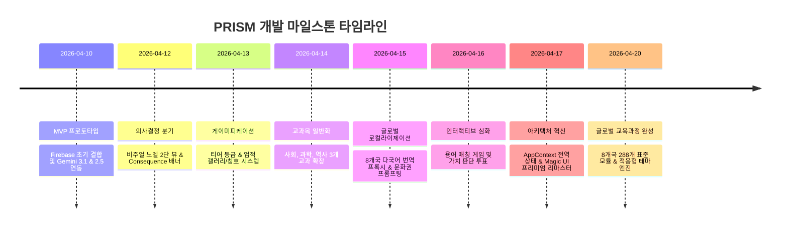

# 📖 개발 일지 색인 (Development Log Index)

> **PRISM (Personalized Reading & Interactive Semantic Module)**  
> 2026년 4월 프로젝트 착수부터 최종 프로덕션 런칭까지의 스프린트별 상세 엔지니어링 기록

---

## 🗓️ 스프린트 타임라인 및 마일스톤 색인

---

## 📂 스프린트별 상세 개발 일지

### 🛠 Phase 1. 코어 프로토타이핑 & 기반 구축
* **[2026-04-10: MVP 탄생 및 기반 구축](./dev_log/2026-04-10_MVP.md)**
  * Firebase Auth / Firestore 실시간 리스너 연결
  * Gemini 3.1 Flash & 2.5 Flash Image 듀얼 파이프라인 개념 검증(PoC)
  * 사회 교과 '민주주의와 자치' 단일 모듈 프로토타입 성공

### ⚙️ Phase 2. 상호작용성 & 게이미피케이션 구축
* **[2026-04-12: 분기점과 인과관계 피드백](./dev_log/2026-04-12_BRANCHING.md)**
  * 의사결정 분기 엔진 및 상단 Consequence 배너 구현
  * 사용자 선택 로그(`storyLogs`) Firestore 영속화
* **[2026-04-13: 게임처럼 즐기는 게이미피케이션](./dev_log/2026-04-13_GAMIFICATION.md)**
  * 5단계 티어 랭크(Bronze ~ Diamond) 산출 가중치 수식 확립
  * 업적 갤러리 및 명예의 전당 칭호 장착 시스템 완성

### 🌐 Phase 3. 도메인 확장 & 글로벌화
* **[2026-04-14: 학습의 일반화 및 개인화](./dev_log/2026-04-14_GENERALIZATION.md)**
  * 과학(우주/물질/생명), 역사(고대/중세/근현대) 전 교과로 도메인 확장
  * 학습자 관심사 태그를 AI 시나리오 서사에 주입하는 메타프롬프트 파이프라인
* **[2026-04-15: 글로벌 8개국 로컬라이제이션](./dev_log/2026-04-15_LOCALIZATION.md)**
  * 8개국(한국, 미국, 일본, 영국, 프랑스, 독일, 이탈리아, 중국) 언어 지원
  * 실시간 UI 번역 프록시 및 문화권 맞춤 프롬프트 엔지니어링

### 💎 Phase 4. 아키텍처 리팩토링 & 프리미엄 UI
* **[2026-04-16: 상호작용의 심화 (미니게임)](./dev_log/2026-04-16_INTERACTION.md)**
  * 서사 도중 핵심 개념 용어 매칭 인터랙션 및 정책 투표 시뮬레이션 통합
* **[2026-04-17: 아키텍처 혁신 및 프리미엄 UX](./dev_log/2026-04-17_ARCHITECTURE.md)**
  * Prop Drilling 제거를 위한 전역 `AppContext` 전환
  * `RetroGrid`, `Particles`, `ShimmerButton`, `BorderBeam` 등 Magic UI 전면 개편

### 🚀 Phase 5. 글로벌 표준 커리큘럼 마스터
* **[2026-04-20: 288개 글로벌 모듈 확정 & 테마 엔진](./dev_log/2026-04-20_PRISM_EXPANSION.md)**
  * 8개국 3개 학교급(초등/중등/고등) 3개 과목 총 288개 정규 모듈 지식 베이스 탑재
  * 학교급별 색상, 곡률, 폰트가 동적으로 리페인팅되는 적응형 테마 엔진(`theme.ts`) 완성

---

  <b><a href="../README.md">🏠 README 메인으로 가기</a> | <a href="./01_PROJECT_PROPOSAL.md">📄 01. 프로젝트 기획서 가기</a></b>

