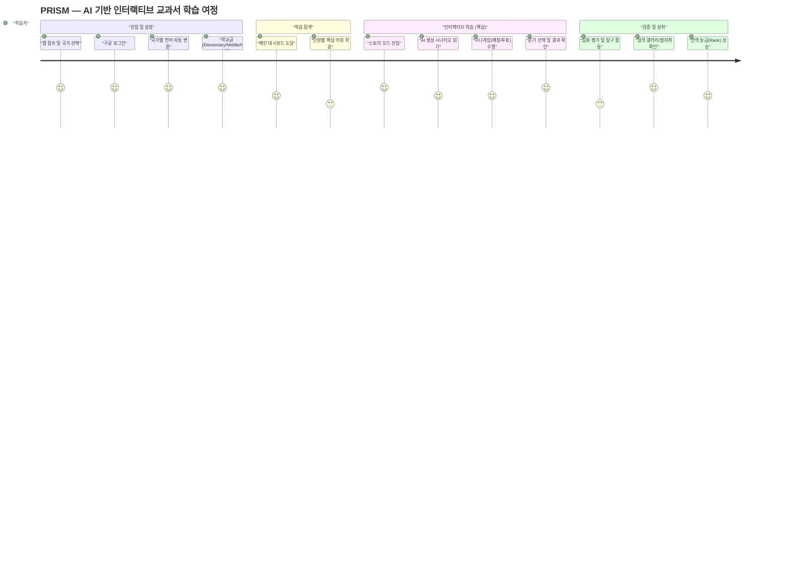

---

## 🗺️ 상세 사용자 여정 지도 (Detailed User Journey Map)

---

## 1. 학습의 시작 (Getting Started)

### 1.1. 로그인 및 국가 설정
- 처음 접속 시 본인의 국가 및 언어를 선택합니다. 한국(KR), 미국(US), 일본(JP) 등 다양한 교육과정이 준비되어 있습니다.
- Google 계정을 통해 간편하게 로그인할 수 있습니다.

### 2.2. 학교급 및 관심사 설정
온보딩 과정에서 학습자의 연령대에 맞는 학교급을 선택합니다.
- **초등학교 (Elementary)**: 기초적인 개념 학습 및 흥미 위주의 시나리오.
- **중학교 (Middle)**: 사회적 원리와 인과관계 탐구 중심.
- **고등학교 (High)**: 깊이 있는 역사 분석 및 비판적 사고 훈련.

관심사(Interests) 키워드를 입력하면, AI가 해당 키워드를 중심으로 개인화된 스토리를 생성합니다. (예: '우주', '로봇', '환경')

### 2.4. 프로필 정보 수정 및 지속성
- **상시 수정 가능**: 로그인 직후뿐만 아니라, **과목 선택(초기 화면) 우측 상단의 [내 프로필] 버튼**을 언제든지 클릭하여 이름, 학교급, 관심사를 변경할 수 있습니다.
- **정보 유지**: 프로필을 수정하더라도 기존에 진행하던 퀴즈 점수나 스토리 로그는 초기화되지 않고 안전하게 보존됩니다.
- **적용 즉시 반영**: 학교급을 변경하고 저장하면 메인 화면으로 돌아오며, 그 즉시 해당 학교급에 맞는 새로운 과목 리스트와 AI 시나리오가 적용됩니다.

### 2.3. 학습 모드 선택
대시보드에서 3가지 단계를 거쳐 단원을 정복합니다.
1. **어휘 학습 (Vocabulary)**: 해당 단원의 핵심 키워드를 AI가 실시간으로 추출하여 카드 형태로 학습.
2. **스토리 모드 (Story)**: 내가 주인공이 되어 내린 선택으로 역사가 바뀌는 인터랙티브 서사.
3. **심화 평가 (Evaluation)**: 객관식, 주관식, 사례 분석 등 고도화된 유형의 퀴즈.

---

## 2. 주요 기능 활용 가이드

### 2.1. 대시보드 (Main Hub)
로그인 후 마주하게 될 학습의 중심지입니다.
- **과목 및 단원 선택**: 상단의 과목 카드를 클릭하여 사회, 과학, 역사 등 원하는 교과를 선택할 수 있습니다.
- **실시간 랭크**: 자신의 닉네임 옆에 표시되는 등급(브론즈~다이아몬드)을 확인하세요. 학습을 완료할수록 등급이 상승합니다.
- **업적 갤러리**: '모든 업적 보기' 버튼을 통해 획득한 배지와 칭호를 확인하고, 내 프로필에 적용할 수 있습니다.

### 2.2. 스토리 모드 (Visual Novel Learning)
이 플랫폼의 핵심인 인터랙티브 스토리텔링 학습입니다.
- **분기 선택**: AI가 생성한 시나리오를 읽고 하단의 선택지 중 하나를 고르세요. 여러분의 선택에 따라 이후의 전개와 이미지가 실시간으로 변화합니다.
- **결과 확인 (Consequence)**: 선택 직후 나타나는 상단 배너를 통해 여러분의 결정이 어떤 변화를 일으켰는지, 그리고 그 안의 교육적 의미는 무엇인지 확인하세요.
- **미니게임**: 스토리 도중 나타나는 용어 매칭이나 투표 시뮬레이션에 참여하여 학습의 재미를 더하세요.

---

### 3.1. 업적 시스템 및 칭호
- **전용 업적 페이지**: 대시보드에서 '모든 업적 보기'를 통해 진입하며, 단원별 특수 업적과 공통 업적을 일괄 조회할 수 있습니다.
- **실시간 칭호 반영**: 가장 높은 등급의 업적을 달성하면 사용자 이름 옆의 칭호가 자동으로 업데이트됩니다.

### 3.2. 나의 스토리 발자취 (Story Timeline)
- 대시보드 하단에서 본인이 지금까지 스토리 모드에서 내린 모든 결정과 그에 따른 **분기 결과(Consequence)**를 타임라인 형태로 확인할 수 있습니다.
- **메타인지 향상**: 본인의 선택 이력을 복기하며, "만약 다른 선택을 했다면?"이라는 호기심을 자극하여 반복 학습을 유도합니다.

### 3.3. 글로벌 학습 및 개인화 설정
- **국가 및 언어 전환**: 로그인 화면에서 8개국(한국, 미국, 일본 등) 중 하나를 선택하면 UI와 AI 생성 콘텐츠가 해당 문화권에 맞춰 즉시 변경됩니다.
- **관심사 반영**: 프로필 설정에서 입력한 관심사는 AI가 스토리를 스토리텔링할 때 핵심 소재로 활용하여 학습 몰입도를 높입니다.

---

## 4. 교육자를 위한 가이드 (For Educators)

- **AI 생성 콘텐츠의 보조적 활용**: 본 플랫폼은 AI를 통해 동적 시나리오를 제공하므로, 학생마다 다른 스토리를 경험하게 됩니다. 이를 학급 내 토론 주제로 활용(예: "너는 왜 그런 선택을 했니?")하면 더 깊은 교육적 효과를 거두 수 있습니다.
- **수준별 개별화 교육**: 학급 내 학생들의 수준이 다를 경우 각자 다른 '레벨'을 선택하게 하여 맞춤형 난이도로 수업을 진행할 수 있습니다.

---

## 5. 자주 묻는 질문 (FAQ)

**Q: 이미지가 로딩되지 않아요.**
A: AI 이미지는 실시간으로 생성되므로 네트워크 환경에 따라 약간의 지연이 발생할 수 있습니다. 1~2초 정도 잠시 기다리시면 환상적인 배경 이미지가 나타납니다.

**Q: 이전 학습 기록을 다시 볼 수 있나요?**
A: 네, 로그인이 되어 있다면 대시보드에서 이전에 진행했던 단계를 언제든 확인하고 'Retry' 버튼을 통해 다른 선택지로 다시 시작할 수 있습니다.

---
[뒤로 가기](../README.md)
