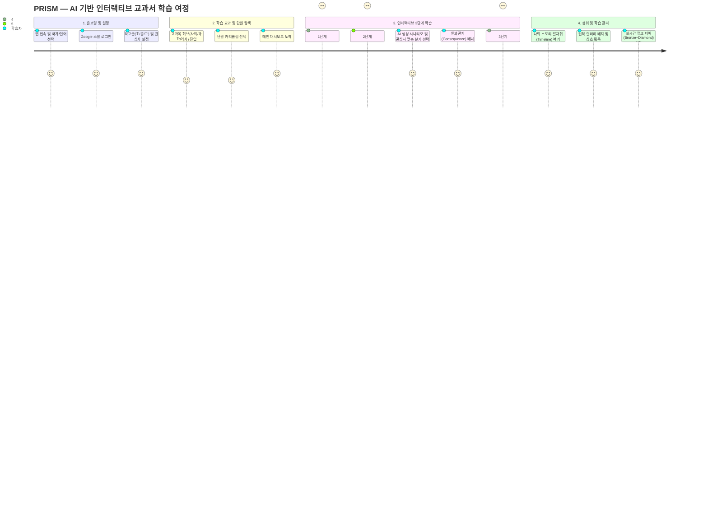
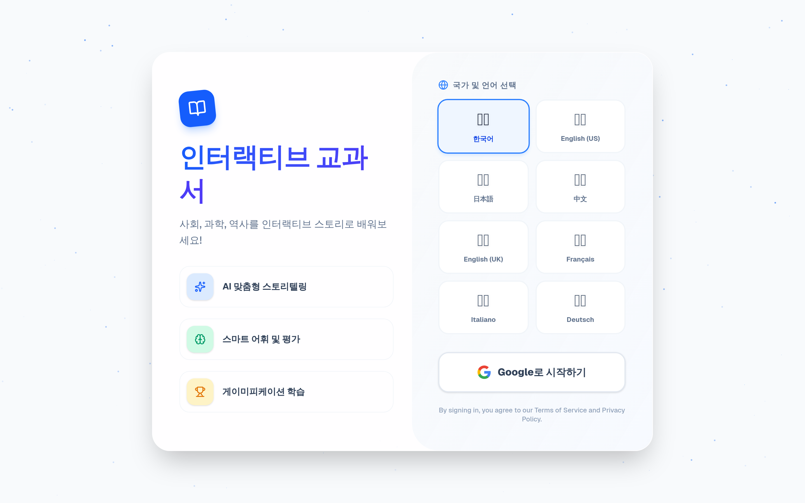
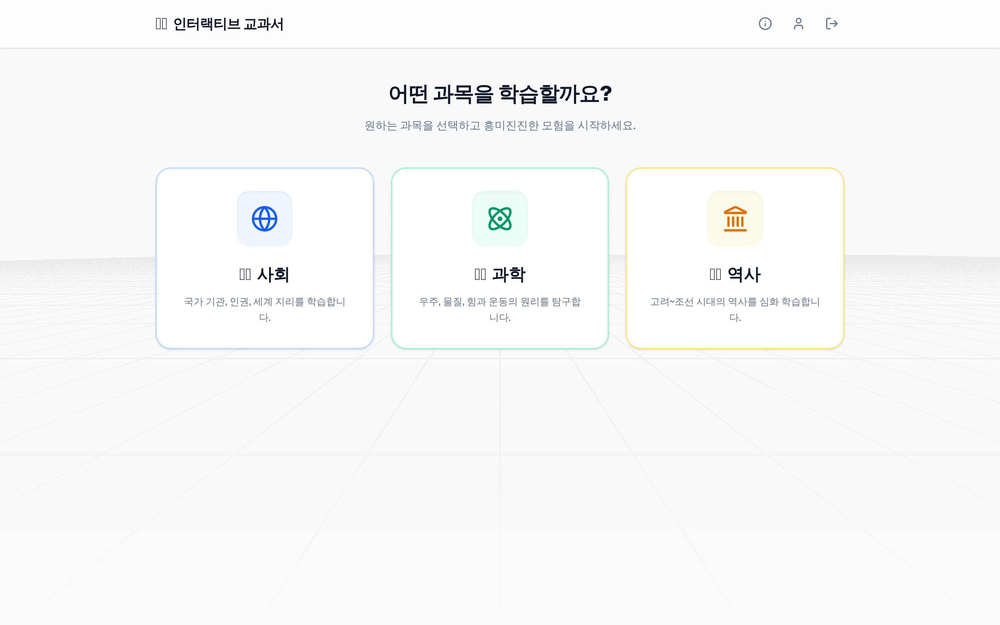
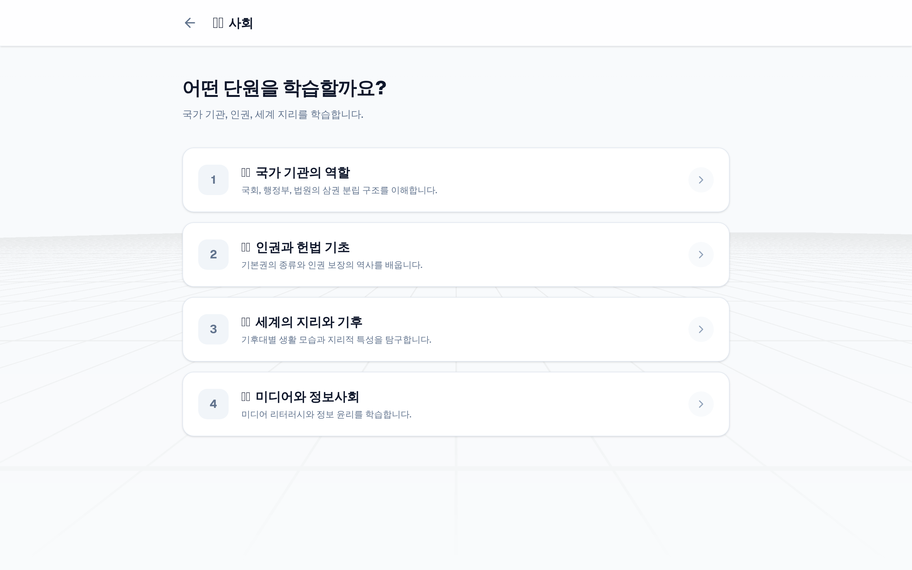
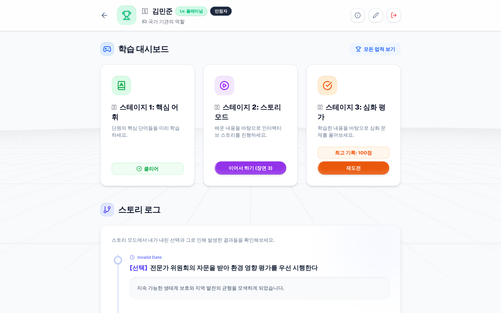
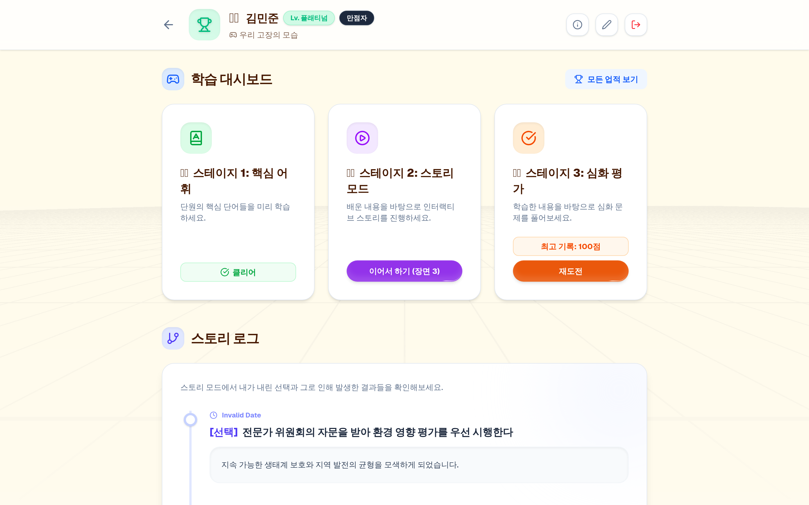
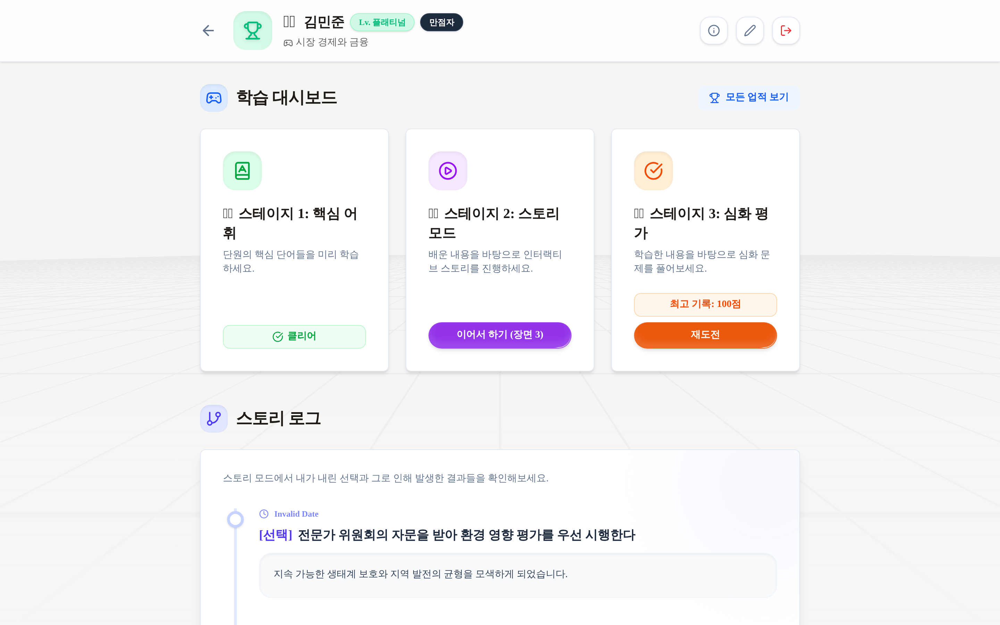
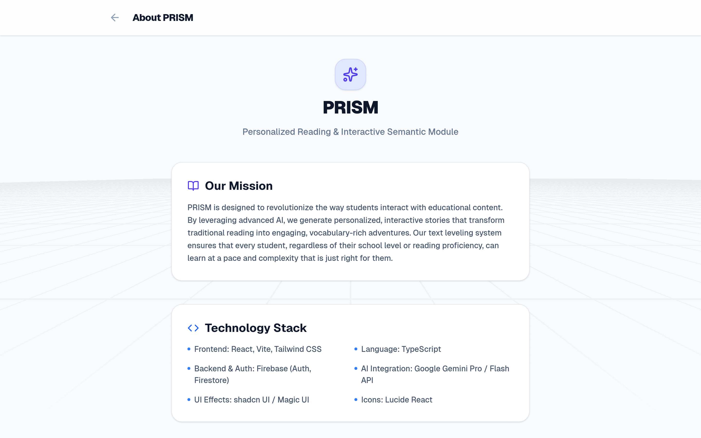

# 📘 PRISM 사용자 매뉴얼 & 학습자 여정 가이드 (User Manual)

> **PRISM (Personalized Reading & Interactive Semantic Module)**  
> AI 기반 넥스트 제너레이션 인터랙티브 교과서 종합 사용자 가이드  
> *본 매뉴얼에 수록된 모든 스크린샷은 실제 구동 중인 PRISM 웹 애플리케이션의 렌더링 화면을 캡처한 실제 화면입니다.*

---

## 🗺️ 1. 상세 사용자 여정 지도 (Detailed User Journey Map)

---

## 🚀 2. 시작하기 (Getting Started)

### 2.1 로그인 및 다국어/국가 설정
PRISM에 처음 접속하면 글로벌 다국어 지원 랜딩 화면이 표시됩니다. 학습자는 화면 우측 상단의 국기 드롭다운 메뉴를 통해 원하는 국가와 언어를 즉시 변경할 수 있습니다.

* **지원 국가 (8개국)**: 🇰🇷 대한민국, 🇺🇸 미국, 🇯🇵 일본, 🇨🇳 중국, 🇬🇧 영국, 🇫🇷 프랑스, 🇮🇹 이탈리아, 🇩🇪 독일
* **소셜 인증**: Google 계정 원클릭 로그인을 통해 개인별 학습 진도와 업적이 안전하게 클라우드(Firebase Firestore)에 동기화됩니다.
* **배경 시각 효과**: Magic UI의 부드러운 파티클 애니메이션과 반응형 글래스모피즘 카드가 적용되어 직관적인 몰입감을 제공합니다.

---

### 2.2 학습자 프로필 및 관심사 온보딩
로그인 후 최초 1회, 학습자 맞춤형 프로필 설정 화면으로 이동합니다.

* **학습자 이름(닉네임)**: 자유롭게 이름을 설정합니다. (스토리 서사 내 주인공 호칭으로 활용)
* **학교급 선택 (3단계)**:
  * 🎒 **초등학교 (Elementary)**: 쉬운 어휘, 친근한 시나리오 중심
  * 🏫 **중학교 (Middle)**: 원리와 사회적 인과관계 탐구 중심
  * 🎓 **고등학교 (High)**: 깊이 있는 헌법·사회 구조 분석 및 비판적 사고 훈련
* **읽기 난이도 선택**: 기본(Basic) / 표준(Standard) / 심화(Advanced)
* **관심사 태그 입력 (최대 3개)**: 학습자가 평소 좋아하는 키워드(예: `우주 과학`, `민주주의`, `AI 로봇`, `환경 생태` 등)를 입력하면, AI가 비주얼 노벨 시나리오 생성 시 해당 관심사를 스토리 전개 및 선택지에 자연스럽게 융합합니다.

---

### 2.3 교과목 선택 허브
프로필 설정이 완료되면 학습자가 탐구할 수 있는 정규 교과목 선택 허브로 진입합니다.

* **교과목 카드**: 
  * 🌐 **사회 (Social Studies)**: 국가 기관, 헌법, 인권, 세계 지리, 미디어 리터러시
  * 🔬 **과학 (Science)**: 태양계와 우주, 물질 상태 변화, 힘과 운동, 인체 순환
  * 🏛️ **역사 (History)**: 고대 건국 신화, 고려·조선의 정치와 외교, 근현대사
* **상단 헤더 유틸리티**:
  * ℹ️ **About PRISM**: 플랫폼 철학 및 시스템 아키텍처 확인
  * 👤 **내 프로필**: 언제든지 학교급, 관심사, 닉네임 수정 가능
  * 🚪 **로그아웃**: 안전한 세션 종료

---

### 2.4 단원 커리큘럼 선택
선택한 교과의 상세 단원 리스트가 체계적으로 제공됩니다.

* 단원별 핵심 학습 목표와 다루는 사회적 원리가 요약 카드로 제시됩니다.
* 단원 카드를 클릭하면 해당 단원의 **학습 대시보드**로 즉시 이동합니다.

---

## 📊 3. 메인 대시보드 & 학습 모드 가이드

### 3.1 메인 대시보드 (Main Learning Hub)
선택한 단원의 학습 진행 상황, 3가지 핵심 학습 모드, 그리고 누적 학습 히스토리가 한눈에 표시되는 컨트롤 타워입니다.

1. **상단 배너 및 실시간 등급(Rank)**:
   * 학습자의 어휘 학습 완료 여부, 스토리 분기 진행 수, 평가 시험 최고 득점을 종합 점수화(100점 만점)하여 실시간 등급을 계산합니다.
   * **등급 체계**: 브론즈(Bronze) → 실버(Silver) → 골드(Gold) → 플래티넘(Platinum) → 다이아몬드(Diamond)
2. **3대 핵심 학습 모드 카드**:
   * 🗂️ **어휘 학습 (Vocabulary)**: 필수 개념어 선행 학습
   * 📖 **스토리 모드 (Story Mode)**: AI 기반 비주얼 노벨 탐구
   * ✍️ **심화 평가 (Evaluation)**: 퀴즈 및 심층 사례 탐구
3. **나의 스토리 발자취 (Story Timeline)**:
   * 스토리 모드에서 학습자가 내린 과거의 모든 선택과 인과관계(Consequence), 획득한 학습 포인트가 시계열 타임라인 카드로 영구 기록됩니다.
   * "내가 다른 선택을 했다면 역사가 어떻게 바뀌었을까?"를 되돌아보는 메타인지 복기 도구입니다.

---

### 3.2 1단계: 어휘 플래시카드 학습 (Vocabulary)
단원의 핵심 개념어를 학습하는 선행 지식 강화 모드입니다.

* **3D 플립 인터랙션**: 카드를 클릭하면 부드럽게 뒤집히며 상세 정의(Definition)와 실제 교과서 예문(Context Example)이 노출됩니다.
* **진도 인디케이터**: 상단 진행 바를 통해 남은 어휘 수를 확인하며 순차적으로 마스터할 수 있습니다.
* **완료 축하 애니메이션**: 모든 어휘를 완독하면 Shimmer 버튼 및 파티클 축하 효과와 함께 대시보드 점수에 즉시 반영됩니다.

---

### 3.3 2단계: 비주얼 노벨 AI 스토리 모드 (Visual Novel Learning)
PRISM의 핵심 기능인 **초개인화 인터랙티브 서사 학습**입니다.

* **2단 분할 레이아웃 (Split Layout)**:
  * **좌측 비주얼 패널**: 현재 시나리오의 핵심 맥락을 시각화한 배경 그래픽과 장면 분위기 연출.
  * **우측 서사 & 분기 패널**: 실시간 생성된 흥미진진한 텍스트 서사와 선택지.
* **관심사 맞춤형 선택지 (Personalized Choices)**:
  * 학습자가 사전 등록한 관심사(예: `민주주의`, `AI 로봇`, `우주 과학`)가 각각의 선택지에 태그로 부여되어 등장합니다.
* **인과관계 피드백 배너 (Consequence Banner)**:
  * 선택지를 클릭하면 학습자가 내린 결정으로 인해 발생한 사회적 파급 효과와 핵심 교과 개념(`Learning Point`)이 상단 강조 배너로 즉각 피드백됩니다.
* **멀티 엔딩 시나리오**: 3회 이상의 의미 있는 선택을 거치면 전체 여정을 종합하는 에필로그 서사가 제공됩니다.

---

### 3.4 3단계: 심화 평가 및 탐구 퀴즈 (Evaluation)
학습한 개념과 의사결정 경험을 확인하는 다면적 평가 모드입니다.

* **다양한 문항 유형 지원**:
  * **객관식 (Multiple Choice)**: 삼권분립, 기본권, 법치주의 등 핵심 개념 검증
  * **사례 연구 (Case Study)**: 실생활 및 미래 사회 딜레마 상황에서의 합리적 판단 탐구
  * **단답형/서술형 (Short Answer)**: 핵심 용어 및 키워드 직접 입력
* **즉각적 피드백 및 해설**: 정답/오답 확인과 함께 친절한 학습 해설이 즉시 제공됩니다.
* **점수 연동**: 최고 득점은 대시보드 종합 랭크에 실시간 반영됩니다.

---

## 🏆 4. 성취 및 학습 관리

### 4.1 업적 갤러리 및 명예의 전당 (Achievements)
학습 과정에서 특정 조건을 달성하면 특별한 배지와 칭호가 잠금 해제됩니다.

* **배지 시스템**: 첫 발걸음(`First Step`), 탐구자(`Curious Mind`), 법의 수호자(`Law Guardian`) 등 교과별·행동별 특수 업적.
* **잠금 상태 시각화**: 아직 달성하지 못한 배지는 흑백 음영 처리와 함께 해금 힌트가 안내됩니다.
* **칭호 장착**: 획득한 대표 업적은 프로필과 대시보드 사용자명 옆에 멋진 칭호로 표시됩니다.

---

### 4.2 수준별 적응형 테마 엔진 (Adaptive Theme System)
PRISM은 학습자의 학교급에 따라 전체 인터페이스의 시각적 톤앤매너를 자동으로 최적화합니다.

#### 🎒 초등학교 테마 (Elementary)
* **특징**: 따뜻한 Amber 컬러 팔레트, 부드럽고 둥근 모서리(`rounded-3xl`), 직관적이고 아기자기한 폰트.

#### 🎓 고등학교 테마 (High School)
* **특징**: 클래식하고 성숙한 Stone/Slate 모노크롬 팔레트, 절제된 곡률(`rounded-lg`), 학술적인 분위기의 명조/고딕 타이포그래피.

---

### 4.3 글로벌 8개국 교육과정 스위칭 (Global Curriculum)
단순 기계 번역이 아닌, 각 국가의 실제 국가 교육과정(미국 NGSS/C3, 일본 학습지도요령 등)에 맞춘 전문 지식 베이스를 제공합니다.

* UI 라벨뿐만 아니라 단원명, 시나리오, 퀴즈 내용까지 선택한 국가의 언어와 역사·사회적 맥락으로 동적 렌더링됩니다.

---

### 4.4 플랫폼 정보 및 기술 아키텍처 (About PRISM)
PRISM의 미션, 기술 스택, 시스템 아키텍처를 안내하는 정보 페이지입니다.

---

## 👩‍🏫 5. 교육자 및 학부모를 위한 활용 가이드 (For Educators)

1. **학급 토론 및 숙의 민주주의 수업 연계**:
   * 동일한 단원이라도 학생들 각자의 관심사와 선택에 따라 다른 시나리오와 분기 결과가 나타납니다.
   * 교실에서 "왜 그 선택을 내렸는지?", "그 선택으로 어떤 결과가 발생했는지?"를 공유하는 비교 토론 수업으로 확장할 수 있습니다.
2. **수준별 개별화 교육 (Differentiated Instruction)**:
   * 학급 내 학습 격차가 있는 경우, 학습자별로 학교급(초등/중등/고등)과 읽기 수준을 개별 설정하여 자기 주도 학습을 진행할 수 있습니다.
3. **포트폴리오 및 학습 이력 평가**:
   * 대시보드의 '나의 스토리 발자취' 타임라인을 확인하여 학생이 특정 딜레마 상황에서 어떤 논리적 판단을 내렸는지 정성적 수행평가 자료로 활용할 수 있습니다.

---

## ❓ 6. 자주 묻는 질문 (FAQ)

* **Q. 학습 중에 학교급이나 관심사를 바꾸면 기존 기록이 지워지나요?**  
  * **A.** 아닙니다! 언제든지 상단 프로필 버튼을 눌러 학교급과 관심사를 변경할 수 있으며, 기존에 획득한 업적, 퀴즈 점수, 스토리 타임라인은 Firestore DB에 안전하게 보존됩니다.
* **Q. 오프라인에서도 학습할 수 있나요?**  
  * **A.** 초기 로딩된 교과 데이터와 어휘 목록은 브라우저 캐시에 유지되지만, AI 실시간 분기 시나리오 생성과 진행도 저장을 위해 안정적인 인터넷 연결이 권장됩니다.
* **Q. 다른 국가의 교육과정으로 공부하고 싶어요.**  
  * **A.** 로그인 화면 또는 메인 헤더의 국기 아이콘을 클릭하여 미국, 영국, 일본 등 다른 국가를 선택하면 즉시 해당 국가의 교육과정 모듈로 학습할 수 있습니다.

---

  <b>PRISM — Personalized Reading & Interactive Semantic Module</b> 
  <i>"우리는 지식을 주입하지 않습니다. 학생들이 스스로 선택하고 경험하게 만듭니다."</i>

