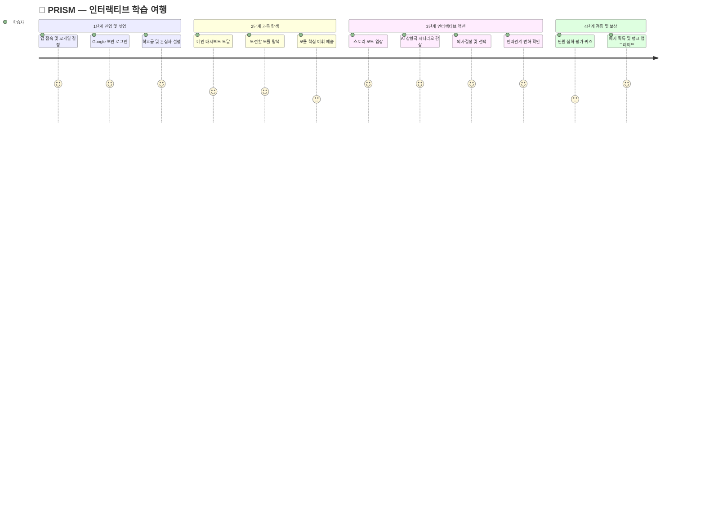

  
  <h1>🎮 PRISM 사용자 매뉴얼 (User Manual)</h1>
  
<b>처음 만나는 인터랙티브 교과서 가이드 및 학습 로드맵</b>

 

> 환영합니다! PRISM은 단순한 텍스트 뷰어가 아닙니다. 여러분의 선택에 따라 이야기가 변화하고, 그 속에서 자연스럽게 교과 지식을 습득하는 "살아있는 교과서"입니다.

---

## 🗺️ 1. 상세 사용자 여정 지도 (User Journey Map)

---

## 🏁 2. 학습의 첫 걸음 (Getting Started)

### 2.1. 글로벌 국가 및 언어 설정 🌐
- 처음 튜토리얼 접속 시 우측 상단 또는 초기 화면에서 본인의 국가를 선택하세요.
- 한국(KR), 미국(US), 일본(JP), 프랑스(FR) 등 8개국의 언어 및 커리큘럼으로 화면이 즉시 자동 전환됩니다.

### 2.2. 학교급(레벨) 및 개인화 관심사 🎒
온보딩 프로필 작성 시 여러분의 눈높이에 맞는 난이도를 결정합니다.
- 🏫 **초등학교 (Elementary)**: 부드럽고 따뜻한 어조. 요정이나 영웅이 되어 교과 개념을 재밌게 배웁니다.
- 🏫 **중학교 (Middle)**: 논리적인 구조. 촌장이나 탐험대장이 되어 인과관계를 추론합니다.
- 🎓 **고등학교 (High)**: 깊이 있는 비판적 사고. 철학적인 난제나 고차원적 딜레마 상황과 마주합니다.
- ✨ **관심사 키워드 (Interests)**: '우주', '해적', '로봇' 등 좋아하는 단어를 넣으면 교과서 지문이 해당 테마 스킨을 입고 나타납니다!

---

## 🕹 3. 핵심 3대 플레이 모드 가이드

### 📖 Step 1. 어휘 학습장 (Vocabulary)
단원 돌파 전, 스토리에 등장할 핵심 어휘를 AI가 추출해 줍니다. 카드를 넘기며 개념을 눈에 발라두세요.

### 🎭 Step 2. 스토리 모드 (Visual Novel)
이 플랫폼의 알파이자 오메가입니다.
- **분기 선택**: AI가 상황을 줍니다 (예: "식량이 부족합니다. 법안을 개정할까요, 이웃 마을과 교역할까요?"). 하단의 버튼을 눌러 여러분만의 운명을 결정하세요.
- **결과 배너**: 선택을 내리면 "결과: 이웃마을과 교역하여 식량난은 해소되었지만 세금이 올랐습니다" 처럼 즉각적인 AI의 인과 피드백을 전달받습니다.
- **배경 일러스트**: 지문 상황에 알맞은 고화질 16:9 배경이 매 장면마다 생성되어 로드됩니다.

### 🧪 Step 3. 심화 평가 (Evaluation)
스토리를 클리어하면, 해당 스토리에서 겪었던 지식을 바탕으로 AI 튜터가 시험을 출제합니다. 득점률에 따라 더 희귀한 칭호를 얻을 수 있습니다.

---

## 🏆 4. 동기부여: 배지와 성과 (Gamification)

- **🖼 업적 갤러리**: 대시보드 좌측 상단 프로필 영역에서 '모든 업적 보기'를 누르세요. 특정 모듈 완수, 완벽 퀴즈 등 다양한 조건 숨겨진 업적 배지를 획득할 수 있습니다.
- **👑 프로필 칭호**: 얻은 배지는 나의 닉네임 박스에 대표 칭호로 장착하여 티어를 뽐낼 수 있습니다. (예: `[법의 수호자] 민철`)
- **🛤 나의 스토리 발자취**: 대시보드 하단 타임라인 뷰에서 과거의 내 선택과 뼈아픈 실책들을 다시 복기해 볼 수 있습니다. (메타인지 강화)

---

## 🧐 5. 자주 묻는 질문 (FAQ)

**Q: 화면 배경 이미지 로딩이 느린 것 같아요.**  
👉 A: AI가 오직 여러분이 입력한 선택지에 맞춰 세상에 없는 그림을 새로 '그려내는' 중입니다. 약 2~4초의 시간을 기다리시면 멋진 맞춤 일러스트가 뜹니다!

**Q: 난이도가 너무 어렵거나 유치해요.**  
👉 A: 언제든지 메인 화면 우측 상단의 `[내 프로필]` 아이콘을 눌러 연령대(초/중/고) 상태를 변경해 보세요. 즉시 난이도가 재설정됩니다.

**Q: 도중에 나가면 저장이 되나요?**  
👉 A: 클라우드 연동을 통해 매 클릭마다 자동 저장됩니다! PC에서 하다가 스마트폰으로 브라우저를 다시 켜도 방금 그 장면부터 시작됩니다.

---

  <b><a href="../README.md">🏠 README 메인으로 가기</a></b>

